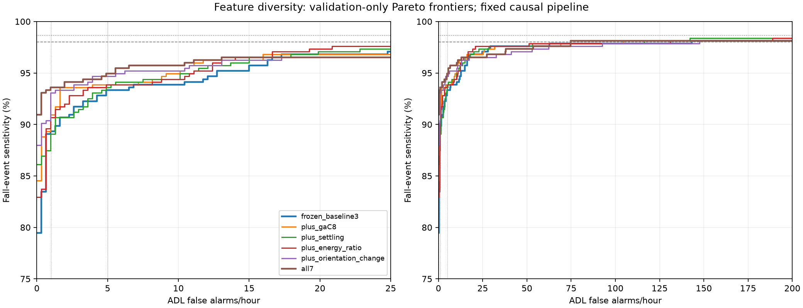

# Controlled physical-feature diversity study for possible MCU v2

## Explicit answers

1. **Does any single feature materially improve the low-FA frontier?** Yes: plus_gaC8, plus_energy_ratio, plus_orientation_change.

2. **Does all7 materially improve the frontier?** Yes under the predefined rule.

3. **Which adds the most complementary information?** plus_orientation_change has the best selected single-feature low-budget rank (1,5,10,20 priority). This is an empirical ranking, not evidence that it adds material information unless it passes the rule. Fixed-C10 comparisons below help separate regularization from feature effects.

4. **Are gains confined to high-FA regions?** No: qualifying single-feature budget sensitivity gains are present; inspect their exact budgets below.

5. **Enough evidence for an MCU v2 feature set?** The material candidates plus_gaC8, plus_energy_ratio, plus_orientation_change, all7 warrant consideration as experimental MCU v2 candidates, with costs and domain limits below. No automatic promotion or independent validation is implied.

## Scope and definitions

Exactly six predefined feature sets and four C values per set were fitted:24 balanced L2 logistic models. No other subset, model family, epsilon, sample interval or C value was searched. MCU v1 and all previous artifacts remain unchanged. Only training/validation raw trials and saved causal candidates are used; no test data or outcomes are used.

The pipeline remains 200 Hz ADXL345 XYZ, causal fourth-order 5 Hz Butterworth, raw-driven 0.5 Hz gravity EMA, the selected magnitude>=1.1g OR magnitude-jerk>=5g/s rising-edge trigger,300-sample refractory, and pre100_post200 window. Its300 samples are [k-100,k+200), available at k+200. No new feature delays the decision.

See [FEATURE_DEFINITIONS.md](FEATURE_DEFINITIONS.md) for equations, units, physical meaning, causality, orientation robustness and MCU costs. ga_C8 retains the existing project sample-variance convention (ddof=1; denominator299). post_mag_variance uses population variance over the late100 samples. The energy ratio uses fixed epsilon1e-6 g². Gravity angle normalizes the mean raw-driven gravity vectors, clamps the dot product, and returns0 radians if either mean norm<1e-8g. Fallback count: 0.

| feature_set | features | C |
|---|---|---|
| frozen_baseline3 | ga_C2, jerk_abs_mean, ga_parallel_peak | 10.0000 |
| baseline3 | ga_C2, jerk_abs_mean, ga_parallel_peak | 10.0000 |
| plus_gaC8 | ga_C2, jerk_abs_mean, ga_parallel_peak, ga_C8 | 1.0000 |
| plus_settling | ga_C2, jerk_abs_mean, ga_parallel_peak, post_mag_variance | 10.0000 |
| plus_energy_ratio | ga_C2, jerk_abs_mean, ga_parallel_peak, pre_post_energy_ratio | 1.0000 |
| plus_orientation_change | ga_C2, jerk_abs_mean, ga_parallel_peak, gravity_direction_change | 0.1000 |
| all7 | ga_C2, jerk_abs_mean, ga_parallel_peak, ga_C8, post_mag_variance, pre_post_energy_ratio, gravity_direction_change | 0.1000 |

frozen_baseline3 is the untouched original C10 reference. baseline3 is a newly fitted experimental C-grid control on the same three features, as requested. Its C10 fit must reproduce the frozen scaler, coefficients and validation scores exactly. All comparisons and materiality judgments use the frozen model, while the refit control exposes regularization-only changes. It is not an additional sensor-feature set.

## Predeclared selection and materiality

Every set has its own training-only StandardScaler and balanced L2/liblinear logistic fit. C grid:0.01,0.1,1,10; max_iter5000, tol1e-8, seed473. No validation refit. Selection prioritizes >98% at<=1FA/h, then >98% at<=5; then detected falls at budgets1,5,10,20 lexicographically; then lower FA cost at>98%,>=95%,>=97%; then smaller C. Each selected model is used across its whole frontier. Feature counts and performance are not traded through an unstated score.

Materiality uses >=1 percentage point gain at one of budgets1/5/10/20 OR >=20% FA reduction at one of targets>=95%,>=97%,>98%, while disqualifying a candidate only if >=1-point regression occurs at BOTH budgets1 AND5. This follows the existing engineering rule (the pasted =1/=20 shorthand is treated as >=). It is a practical gate, not a statistical significance claim.

| candidate | material | eligible | both_low_regress | gain_pp_FA1 | gain_pp_FA5 | gain_pp_FA10 | gain_pp_FA20 | FA_reduction_pct_sens_ge95 | FA_reduction_pct_sens_ge97 | FA_reduction_pct_sens_gt98 |
|---|---|---|---|---|---|---|---|---|---|---|
| baseline3_C0.01 | True | True | False | -4.8000 | -0.8000 | 0.5333 | -0.5333 | -12.8205 | -17.1053 | 45.3303 |
| baseline3_C0.1 | False | True | False | -1.0667 | -0.8000 | 0.0000 | 0.0000 | 0.0000 | -7.8947 | 16.6287 |
| baseline3_C1 | False | True | False | -0.2667 | -0.2667 | 0.0000 | 0.0000 | -2.5641 | -1.3158 | -2.7335 |
| baseline3_C10 | False | True | False | 0.0000 | 0.0000 | 0.0000 | 0.0000 | 0.0000 | 0.0000 | 0.0000 |
| plus_gaC8_C0.01 | False | True | True | -3.7333 | -1.6000 | 0.5333 | -0.5333 | 12.8205 | -18.4211 | 44.4191 |
| plus_gaC8_C0.1 | True | True | False | 0.8000 | 0.0000 | 0.8000 | 0.0000 | 15.3846 | -3.9474 | 41.9134 |
| plus_gaC8_C1 | True | True | False | 1.6000 | 0.5333 | 1.0667 | 0.0000 | 20.5128 | -1.3158 | 27.1071 |
| plus_gaC8_C10 | True | True | False | 1.3333 | 0.5333 | 1.0667 | 0.0000 | 17.9487 | 1.3158 | 25.2847 |
| plus_settling_C0.01 | True | True | False | -1.6000 | -0.2667 | 0.8000 | -0.5333 | -2.5641 | 11.8421 | 53.9863 |
| plus_settling_C0.1 | True | True | False | -1.3333 | -0.2667 | 1.0667 | 0.0000 | 2.5641 | 18.4211 | 56.0364 |
| plus_settling_C1 | True | True | False | -0.8000 | 0.2667 | 0.8000 | 0.2667 | 12.8205 | 19.7368 | 26.6515 |
| plus_settling_C10 | False | True | False | -0.2667 | 0.2667 | 0.5333 | 0.2667 | 12.8205 | 19.7368 | 18.6788 |
| plus_energy_ratio_C0.01 | True | True | False | -4.2667 | -0.8000 | 0.2667 | -0.5333 | -2.5641 | -11.8421 | 46.0137 |
| plus_energy_ratio_C0.1 | True | True | False | 0.2667 | -0.8000 | 0.0000 | 0.0000 | 12.8205 | 10.5263 | 20.0456 |
| plus_energy_ratio_C1 | True | True | False | 1.3333 | 0.5333 | 0.5333 | 0.5333 | 12.8205 | 32.8947 | 8.4282 |
| plus_energy_ratio_C10 | True | True | False | 1.0667 | 0.2667 | 0.5333 | 0.8000 | 15.3846 | 30.2632 | 14.1230 |
| plus_orientation_change_C0.01 | True | True | False | 1.0667 | 0.0000 | 0.2667 | -1.0667 | -12.8205 | -247.3684 | 2.9613 |
| plus_orientation_change_C0.1 | True | True | False | 3.7333 | 1.3333 | 1.3333 | -0.2667 | 51.2821 | -65.7895 | -3.1891 |
| plus_orientation_change_C1 | True | True | False | 2.9333 | 1.6000 | 1.8667 | -0.2667 | 58.9744 | -21.0526 | -24.6014 |
| plus_orientation_change_C10 | True | True | False | 3.2000 | 1.3333 | 1.8667 | -0.2667 | 56.4103 | -15.7895 | -21.6401 |
| all7_C0.01 | True | True | False | 2.6667 | 0.2667 | 0.8000 | -0.5333 | 5.1282 | -127.6316 | 17.0843 |
| all7_C0.1 | True | True | False | 4.2667 | 1.6000 | 1.8667 | -0.2667 | 56.4103 | -52.6316 | 47.8360 |
| all7_C1 | True | True | False | 4.0000 | 1.8667 | 2.1333 | 0.0000 | 61.5385 | 11.8421 | 40.3189 |
| all7_C10 | True | True | False | 3.2000 | 1.3333 | 2.4000 | 0.2667 | 53.8462 | 27.6316 | 36.4465 |

## Frontier comparison

Plot axes are cropped for detail; all exact values and full nondominated frontiers are in CSVs. Sensitivity columns below are fractions, FA columns are alarms/hour.

| feature_set | C | sens_FA1 | sens_FA5 | sens_FA10 | sens_FA20 | FA_sens_ge95 | FA_sens_ge97 | FA_sens_gt98 |
|---|---|---|---|---|---|---|---|---|
| frozen_baseline3 | 10.0000 | 0.8933 | 0.9333 | 0.9387 | 0.9680 | 12.7121 | 24.7723 | 143.0927 |
| baseline3 | 10.0000 | 0.8933 | 0.9333 | 0.9387 | 0.9680 | 12.7121 | 24.7723 | 143.0927 |
| plus_gaC8 | 1.0000 | 0.9093 | 0.9387 | 0.9493 | 0.9680 | 10.1045 | 25.0983 | 104.3045 |
| plus_settling | 10.0000 | 0.8907 | 0.9360 | 0.9440 | 0.9707 | 11.0823 | 19.8830 | 116.3647 |
| plus_energy_ratio | 1.0000 | 0.9067 | 0.9387 | 0.9440 | 0.9733 | 11.0823 | 16.6235 | 131.0325 |
| plus_orientation_change | 0.1000 | 0.9307 | 0.9467 | 0.9520 | 0.9653 | 6.1931 | 41.0699 | 147.6560 |
| all7 | 0.1000 | 0.9360 | 0.9493 | 0.9573 | 0.9653 | 5.5412 | 37.8104 | 74.6429 |

| feature_set | operating_point | sensitivity_delta_pp | FA_delta | detected_delta | sensitivity_delta_vs_refit_control_pp |
|---|---|---|---|---|---|
| frozen_baseline3 | FA_le_1 | 0.0000 | 0.0000 | 0.0000 | 0.0000 |
| frozen_baseline3 | FA_le_5 | 0.0000 | 0.0000 | 0.0000 | 0.0000 |
| frozen_baseline3 | FA_le_10 | 0.0000 | 0.0000 | 0.0000 | 0.0000 |
| frozen_baseline3 | FA_le_20 | 0.0000 | 0.0000 | 0.0000 | 0.0000 |
| frozen_baseline3 | sens_ge95 | 0.0000 | 0.0000 | 0.0000 | 0.0000 |
| frozen_baseline3 | sens_ge97 | 0.0000 | 0.0000 | 0.0000 | 0.0000 |
| frozen_baseline3 | sens_gt98 | 0.0000 | 0.0000 | 0.0000 | 0.0000 |
| frozen_baseline3 | BA_reference | 0.0000 | 0.0000 | 0.0000 | 0.0000 |
| baseline3 | FA_le_1 | 0.0000 | 0.0000 | 0.0000 | 0.0000 |
| baseline3 | FA_le_5 | 0.0000 | 0.0000 | 0.0000 | 0.0000 |
| baseline3 | FA_le_10 | 0.0000 | 0.0000 | 0.0000 | 0.0000 |
| baseline3 | FA_le_20 | 0.0000 | 0.0000 | 0.0000 | 0.0000 |
| baseline3 | sens_ge95 | 0.0000 | 0.0000 | 0.0000 | 0.0000 |
| baseline3 | sens_ge97 | 0.0000 | 0.0000 | 0.0000 | 0.0000 |
| baseline3 | sens_gt98 | 0.0000 | 0.0000 | 0.0000 | 0.0000 |
| baseline3 | BA_reference | 0.0000 | 0.0000 | 0.0000 | 0.0000 |
| plus_gaC8 | FA_le_1 | 1.6000 | 0.0000 | 6.0000 | 1.6000 |
| plus_gaC8 | FA_le_5 | 0.5333 | -0.9779 | 2.0000 | 0.5333 |
| plus_gaC8 | FA_le_10 | 1.0667 | 2.2817 | 4.0000 | 1.0667 |
| plus_gaC8 | FA_le_20 | 0.0000 | -1.3038 | 0.0000 | 0.0000 |
| plus_gaC8 | sens_ge95 | 0.0000 | -2.6076 | 0.0000 | 0.0000 |
| plus_gaC8 | sens_ge97 | 0.0000 | 0.3260 | 0.0000 | 0.0000 |
| plus_gaC8 | sens_gt98 | 0.0000 | -38.7882 | 0.0000 | 0.0000 |
| plus_gaC8 | BA_reference | 0.2667 | -3.2595 | 1.0000 | 0.2667 |
| plus_settling | FA_le_1 | -0.2667 | 0.0000 | -1.0000 | -0.2667 |
| plus_settling | FA_le_5 | 0.2667 | 0.0000 | 1.0000 | 0.2667 |
| plus_settling | FA_le_10 | 0.5333 | 0.6519 | 2.0000 | 0.5333 |
| plus_settling | FA_le_20 | 0.2667 | 2.6076 | 1.0000 | 0.2667 |
| plus_settling | sens_ge95 | 0.0000 | -1.6298 | 0.0000 | 0.0000 |
| plus_settling | sens_ge97 | 0.0000 | -4.8893 | 0.0000 | 0.0000 |
| plus_settling | sens_gt98 | 0.0000 | -26.7280 | 0.0000 | 0.0000 |
| plus_settling | BA_reference | 0.8000 | 0.6519 | 3.0000 | 0.8000 |
| plus_energy_ratio | FA_le_1 | 1.3333 | 0.0000 | 5.0000 | 1.3333 |
| plus_energy_ratio | FA_le_5 | 0.5333 | 0.0000 | 2.0000 | 0.5333 |
| plus_energy_ratio | FA_le_10 | 0.5333 | 1.9557 | 2.0000 | 0.5333 |
| plus_energy_ratio | FA_le_20 | 0.5333 | 1.9557 | 2.0000 | 0.5333 |
| plus_energy_ratio | sens_ge95 | 0.0000 | -1.6298 | 0.0000 | 0.0000 |
| plus_energy_ratio | sens_ge97 | 0.0000 | -8.1488 | 0.0000 | 0.0000 |
| plus_energy_ratio | sens_gt98 | 0.0000 | -12.0602 | 0.0000 | 0.0000 |
| plus_energy_ratio | BA_reference | 0.2667 | -1.3038 | 1.0000 | 0.2667 |
| plus_orientation_change | FA_le_1 | 3.7333 | 0.0000 | 14.0000 | 3.7333 |
| plus_orientation_change | FA_le_5 | 1.3333 | -0.9779 | 5.0000 | 1.3333 |
| plus_orientation_change | FA_le_10 | 1.3333 | -0.6519 | 5.0000 | 1.3333 |
| plus_orientation_change | FA_le_20 | -0.2667 | 0.0000 | -1.0000 | -0.2667 |
| plus_orientation_change | sens_ge95 | 0.0000 | -6.5190 | 0.0000 | 0.0000 |
| plus_orientation_change | sens_ge97 | 0.0000 | 16.2976 | 0.0000 | 0.0000 |
| plus_orientation_change | sens_gt98 | 0.0000 | 4.5633 | 0.0000 | 0.0000 |
| plus_orientation_change | BA_reference | 1.3333 | -0.9779 | 5.0000 | 1.3333 |
| all7 | FA_le_1 | 4.2667 | 0.0000 | 16.0000 | 4.2667 |
| all7 | FA_le_5 | 1.6000 | 0.0000 | 6.0000 | 1.6000 |
| all7 | FA_le_10 | 1.8667 | -0.3260 | 7.0000 | 1.8667 |
| all7 | FA_le_20 | -0.2667 | -4.2374 | -1.0000 | -0.2667 |
| all7 | sens_ge95 | 0.2667 | -7.1709 | 1.0000 | 0.2667 |
| all7 | sens_ge97 | 0.0000 | 13.0381 | 0.0000 | 0.0000 |
| all7 | sens_gt98 | 0.0000 | -68.4498 | 0.0000 | 0.0000 |
| all7 | BA_reference | 0.8000 | -2.9336 | 3.0000 | 0.8000 |

## Operating points and engineering targets

| feature_set | primary_achieved | secondary_achieved | sensitivity_FA1 | sensitivity_FA5 | minimum_FA_to_exceed98 | additional_detections_needed_FA1 | additional_detections_needed_FA5 |
|---|---|---|---|---|---|---|---|
| frozen_baseline3 | False | False | 0.8933 | 0.9333 | 143.0927 | 33.0000 | 18.0000 |
| baseline3 | False | False | 0.8933 | 0.9333 | 143.0927 | 33.0000 | 18.0000 |
| plus_gaC8 | False | False | 0.9093 | 0.9387 | 104.3045 | 27.0000 | 16.0000 |
| plus_settling | False | False | 0.8907 | 0.9360 | 116.3647 | 34.0000 | 17.0000 |
| plus_energy_ratio | False | False | 0.9067 | 0.9387 | 131.0325 | 28.0000 | 16.0000 |
| plus_orientation_change | False | False | 0.9307 | 0.9467 | 147.6560 | 19.0000 | 13.0000 |
| all7 | False | False | 0.9360 | 0.9493 | 74.6429 | 17.0000 | 12.0000 |

Primary requires sensitivity strictly>98% and ADL FA/h<=1; secondary requires strictly>98% and<=5. With375 fall trials, >98% requires368 detections. The candidate ceiling is370/375=98.6667%, leaving at most two classifier misses. Five no-matched-trigger misses are immutable here. The ceiling prevents100% but is above98%; therefore failure at an alarm budget cannot be attributed solely to the trigger. The closest constraint-wise Pareto points are FA_le_1/FA_le_5 and sens_gt98; no arbitrary joint-distance metric is introduced.

| feature_set | trigger_misses | classifier_misses_FA1 | classifier_misses_FA5 |
|---|---|---|---|
| frozen_baseline3 | 5.0000 | 35.0000 | 20.0000 |
| baseline3 | 5.0000 | 35.0000 | 20.0000 |
| plus_gaC8 | 5.0000 | 29.0000 | 18.0000 |
| plus_settling | 5.0000 | 36.0000 | 19.0000 |
| plus_energy_ratio | 5.0000 | 30.0000 | 18.0000 |
| plus_orientation_change | 5.0000 | 21.0000 | 15.0000 |
| all7 | 5.0000 | 19.0000 | 14.0000 |

| feature_set | operating_point | threshold | sensitivity | false_alarms_per_adl_hour | event_precision | trial_specificity | trial_balanced_accuracy | detected_falls | missed_falls | total_alarms |
|---|---|---|---|---|---|---|---|---|---|---|
| frozen_baseline3 | FA_le_1 | 0.9435 | 0.8933 | 0.9779 | 0.9654 | 0.9948 | 0.9440 | 335.0000 | 40.0000 | 347.0000 |
| frozen_baseline3 | FA_le_5 | 0.8851 | 0.9333 | 4.8893 | 0.9309 | 0.9773 | 0.9553 | 350.0000 | 25.0000 | 376.0000 |
| frozen_baseline3 | FA_le_10 | 0.8622 | 0.9387 | 6.8450 | 0.9167 | 0.9703 | 0.9545 | 352.0000 | 23.0000 | 384.0000 |
| frozen_baseline3 | FA_le_20 | 0.7353 | 0.9680 | 17.2754 | 0.8403 | 0.9248 | 0.9464 | 363.0000 | 12.0000 | 432.0000 |
| frozen_baseline3 | sens_ge95 | 0.7742 | 0.9520 | 12.7121 | 0.8707 | 0.9423 | 0.9472 | 357.0000 | 18.0000 | 410.0000 |
| frozen_baseline3 | sens_ge97 | 0.6102 | 0.9707 | 24.7723 | 0.7913 | 0.8986 | 0.9346 | 364.0000 | 11.0000 | 460.0000 |
| frozen_baseline3 | sens_gt98 | 0.0756 | 0.9813 | 143.0927 | 0.4044 | 0.5420 | 0.7616 | 368.0000 | 7.0000 | 910.0000 |
| frozen_baseline3 | BA_reference | 0.8851 | 0.9333 | 4.8893 | 0.9309 | 0.9773 | 0.9553 | 350.0000 | 25.0000 | 376.0000 |
| baseline3 | FA_le_1 | 0.9435 | 0.8933 | 0.9779 | 0.9654 | 0.9948 | 0.9440 | 335.0000 | 40.0000 | 347.0000 |
| baseline3 | FA_le_5 | 0.8851 | 0.9333 | 4.8893 | 0.9309 | 0.9773 | 0.9553 | 350.0000 | 25.0000 | 376.0000 |
| baseline3 | FA_le_10 | 0.8622 | 0.9387 | 6.8450 | 0.9167 | 0.9703 | 0.9545 | 352.0000 | 23.0000 | 384.0000 |
| baseline3 | FA_le_20 | 0.7353 | 0.9680 | 17.2754 | 0.8403 | 0.9248 | 0.9464 | 363.0000 | 12.0000 | 432.0000 |
| baseline3 | sens_ge95 | 0.7742 | 0.9520 | 12.7121 | 0.8707 | 0.9423 | 0.9472 | 357.0000 | 18.0000 | 410.0000 |
| baseline3 | sens_ge97 | 0.6102 | 0.9707 | 24.7723 | 0.7913 | 0.8986 | 0.9346 | 364.0000 | 11.0000 | 460.0000 |
| baseline3 | sens_gt98 | 0.0756 | 0.9813 | 143.0927 | 0.4044 | 0.5420 | 0.7616 | 368.0000 | 7.0000 | 910.0000 |
| baseline3 | BA_reference | 0.8851 | 0.9333 | 4.8893 | 0.9309 | 0.9773 | 0.9553 | 350.0000 | 25.0000 | 376.0000 |
| plus_gaC8 | FA_le_1 | 0.9325 | 0.9093 | 0.9779 | 0.9688 | 0.9948 | 0.9520 | 341.0000 | 34.0000 | 352.0000 |
| plus_gaC8 | FA_le_5 | 0.8781 | 0.9387 | 3.9114 | 0.9387 | 0.9808 | 0.9597 | 352.0000 | 23.0000 | 375.0000 |
| plus_gaC8 | FA_le_10 | 0.8220 | 0.9493 | 9.1266 | 0.8990 | 0.9563 | 0.9528 | 356.0000 | 19.0000 | 396.0000 |
| plus_gaC8 | FA_le_20 | 0.7343 | 0.9680 | 15.9716 | 0.8462 | 0.9318 | 0.9499 | 363.0000 | 12.0000 | 429.0000 |
| plus_gaC8 | sens_ge95 | 0.7953 | 0.9520 | 10.1045 | 0.8925 | 0.9545 | 0.9533 | 357.0000 | 18.0000 | 400.0000 |
| plus_gaC8 | sens_ge97 | 0.5963 | 0.9707 | 25.0983 | 0.7913 | 0.8934 | 0.9320 | 364.0000 | 11.0000 | 460.0000 |
| plus_gaC8 | sens_gt98 | 0.1244 | 0.9813 | 104.3045 | 0.4842 | 0.6416 | 0.8115 | 368.0000 | 7.0000 | 760.0000 |
| plus_gaC8 | BA_reference | 0.9051 | 0.9360 | 1.6298 | 0.9590 | 0.9913 | 0.9636 | 351.0000 | 24.0000 | 366.0000 |
| plus_settling | FA_le_1 | 0.9510 | 0.8907 | 0.9779 | 0.9653 | 0.9948 | 0.9427 | 334.0000 | 41.0000 | 346.0000 |
| plus_settling | FA_le_5 | 0.8746 | 0.9360 | 4.8893 | 0.9310 | 0.9738 | 0.9549 | 351.0000 | 24.0000 | 377.0000 |
| plus_settling | FA_le_10 | 0.8395 | 0.9440 | 7.4969 | 0.9100 | 0.9650 | 0.9545 | 354.0000 | 21.0000 | 389.0000 |
| plus_settling | FA_le_20 | 0.6712 | 0.9707 | 19.8830 | 0.8254 | 0.9091 | 0.9399 | 364.0000 | 11.0000 | 441.0000 |
| plus_settling | sens_ge95 | 0.7774 | 0.9520 | 11.0823 | 0.8815 | 0.9458 | 0.9489 | 357.0000 | 18.0000 | 405.0000 |
| plus_settling | sens_ge97 | 0.6712 | 0.9707 | 19.8830 | 0.8254 | 0.9091 | 0.9399 | 364.0000 | 11.0000 | 441.0000 |
| plus_settling | sens_gt98 | 0.1006 | 0.9813 | 116.3647 | 0.4566 | 0.6049 | 0.7931 | 368.0000 | 7.0000 | 806.0000 |
| plus_settling | BA_reference | 0.8638 | 0.9413 | 5.5412 | 0.9265 | 0.9720 | 0.9567 | 353.0000 | 22.0000 | 381.0000 |
| plus_energy_ratio | FA_le_1 | 0.9421 | 0.9067 | 0.9779 | 0.9659 | 0.9948 | 0.9507 | 340.0000 | 35.0000 | 352.0000 |
| plus_energy_ratio | FA_le_5 | 0.8777 | 0.9387 | 4.8893 | 0.9312 | 0.9738 | 0.9562 | 352.0000 | 23.0000 | 378.0000 |
| plus_energy_ratio | FA_le_10 | 0.8253 | 0.9440 | 8.8007 | 0.9008 | 0.9580 | 0.9510 | 354.0000 | 21.0000 | 393.0000 |
| plus_energy_ratio | FA_le_20 | 0.6013 | 0.9733 | 19.2311 | 0.8202 | 0.9143 | 0.9438 | 365.0000 | 10.0000 | 445.0000 |
| plus_energy_ratio | sens_ge95 | 0.7825 | 0.9520 | 11.0823 | 0.8815 | 0.9476 | 0.9498 | 357.0000 | 18.0000 | 405.0000 |
| plus_energy_ratio | sens_ge97 | 0.6409 | 0.9707 | 16.6235 | 0.8406 | 0.9266 | 0.9486 | 364.0000 | 11.0000 | 433.0000 |
| plus_energy_ratio | sens_gt98 | 0.0812 | 0.9813 | 131.0325 | 0.4220 | 0.5682 | 0.7748 | 368.0000 | 7.0000 | 872.0000 |
| plus_energy_ratio | BA_reference | 0.8943 | 0.9360 | 3.5855 | 0.9410 | 0.9808 | 0.9584 | 351.0000 | 24.0000 | 373.0000 |
| plus_orientation_change | FA_le_1 | 0.9261 | 0.9307 | 0.9779 | 0.9749 | 0.9948 | 0.9627 | 349.0000 | 26.0000 | 358.0000 |
| plus_orientation_change | FA_le_5 | 0.8711 | 0.9467 | 3.9114 | 0.9492 | 0.9825 | 0.9646 | 355.0000 | 20.0000 | 374.0000 |
| plus_orientation_change | FA_le_10 | 0.8504 | 0.9520 | 6.1931 | 0.9321 | 0.9703 | 0.9611 | 357.0000 | 18.0000 | 383.0000 |
| plus_orientation_change | FA_le_20 | 0.7187 | 0.9653 | 17.2754 | 0.8498 | 0.9196 | 0.9425 | 362.0000 | 13.0000 | 426.0000 |
| plus_orientation_change | sens_ge95 | 0.8504 | 0.9520 | 6.1931 | 0.9321 | 0.9703 | 0.9611 | 357.0000 | 18.0000 | 383.0000 |
| plus_orientation_change | sens_ge97 | 0.4405 | 0.9707 | 41.0699 | 0.7123 | 0.8374 | 0.9040 | 364.0000 | 11.0000 | 511.0000 |
| plus_orientation_change | sens_gt98 | 0.0992 | 0.9813 | 147.6560 | 0.4112 | 0.4878 | 0.7345 | 368.0000 | 7.0000 | 895.0000 |
| plus_orientation_change | BA_reference | 0.8711 | 0.9467 | 3.9114 | 0.9492 | 0.9825 | 0.9646 | 355.0000 | 20.0000 | 374.0000 |
| all7 | FA_le_1 | 0.9088 | 0.9360 | 0.9779 | 0.9723 | 0.9948 | 0.9654 | 351.0000 | 24.0000 | 361.0000 |
| all7 | FA_le_5 | 0.8412 | 0.9493 | 4.8893 | 0.9368 | 0.9738 | 0.9616 | 356.0000 | 19.0000 | 380.0000 |
| all7 | FA_le_10 | 0.8233 | 0.9573 | 6.5190 | 0.9253 | 0.9650 | 0.9612 | 359.0000 | 16.0000 | 388.0000 |
| all7 | FA_le_20 | 0.7467 | 0.9653 | 13.0381 | 0.8786 | 0.9371 | 0.9512 | 362.0000 | 13.0000 | 412.0000 |
| all7 | sens_ge95 | 0.8309 | 0.9547 | 5.5412 | 0.9323 | 0.9703 | 0.9625 | 358.0000 | 17.0000 | 384.0000 |
| all7 | sens_ge97 | 0.4492 | 0.9707 | 37.8104 | 0.7280 | 0.8409 | 0.9058 | 364.0000 | 11.0000 | 500.0000 |
| all7 | sens_gt98 | 0.2127 | 0.9813 | 74.6429 | 0.5750 | 0.7028 | 0.8421 | 368.0000 | 7.0000 | 640.0000 |
| all7 | BA_reference | 0.8959 | 0.9413 | 1.9557 | 0.9645 | 0.9895 | 0.9654 | 353.0000 | 22.0000 | 366.0000 |

Every unique validation positive score plus a no-alarm boundary is swept. Decisions use score>=threshold. Budget points maximize detections then minimize FA/h and positive decisions. Sensitivity targets minimize FA/h subject to the target, breaking ties by more detections/fewer decisions/higher threshold. At a no-alarm boundary precision is undefined. BA_reference is diagnostic, not a replacement deployment threshold.

## Difficult activities: matched budget comparison

The following directly compares each selected set with frozen MCU v1 at<=5FA/hour. focus_activity_changes.csv covers all requested points; activity_metrics.csv covers every activity. These conditional operating-point comparisons should not be interpreted as causal physical explanations of individual mistakes.

| feature_set | operating_point | activity | sensitivity | sensitivity_delta_pp | FA_per_hour | FA_per_hour_delta | no_matched_candidate | matched_candidates_rejected |
|---|---|---|---|---|---|---|---|---|
| frozen_baseline3 | FA_le_5 | D06 | N/A | N/A | 5.7603 | 0.0000 | 0.0000 | 0.0000 |
| frozen_baseline3 | FA_le_5 | D18 | N/A | N/A | 24.0012 | 0.0000 | 0.0000 | 0.0000 |
| frozen_baseline3 | FA_le_5 | D19 | N/A | N/A | 84.0000 | 0.0000 | 0.0000 | 0.0000 |
| frozen_baseline3 | FA_le_5 | F13 | 0.8000 | 0.0000 | N/A | N/A | 0.0000 | 5.0000 |
| frozen_baseline3 | FA_le_5 | F14 | 1.0000 | 0.0000 | N/A | N/A | 0.0000 | 0.0000 |
| frozen_baseline3 | FA_le_5 | F15 | 0.9200 | 0.0000 | N/A | N/A | 0.0000 | 2.0000 |
| baseline3 | FA_le_5 | D06 | N/A | N/A | 5.7603 | 0.0000 | 0.0000 | 0.0000 |
| baseline3 | FA_le_5 | D18 | N/A | N/A | 24.0012 | 0.0000 | 0.0000 | 0.0000 |
| baseline3 | FA_le_5 | D19 | N/A | N/A | 84.0000 | 0.0000 | 0.0000 | 0.0000 |
| baseline3 | FA_le_5 | F13 | 0.8000 | 0.0000 | N/A | N/A | 0.0000 | 5.0000 |
| baseline3 | FA_le_5 | F14 | 1.0000 | 0.0000 | N/A | N/A | 0.0000 | 0.0000 |
| baseline3 | FA_le_5 | F15 | 0.9200 | 0.0000 | N/A | N/A | 0.0000 | 2.0000 |
| plus_gaC8 | FA_le_5 | D06 | N/A | N/A | 5.7603 | 0.0000 | 0.0000 | 0.0000 |
| plus_gaC8 | FA_le_5 | D18 | N/A | N/A | 12.0006 | -12.0006 | 0.0000 | 0.0000 |
| plus_gaC8 | FA_le_5 | D19 | N/A | N/A | 48.0000 | -36.0000 | 0.0000 | 0.0000 |
| plus_gaC8 | FA_le_5 | F13 | 0.8800 | 8.0000 | N/A | N/A | 0.0000 | 3.0000 |
| plus_gaC8 | FA_le_5 | F14 | 1.0000 | 0.0000 | N/A | N/A | 0.0000 | 0.0000 |
| plus_gaC8 | FA_le_5 | F15 | 0.9200 | 0.0000 | N/A | N/A | 0.0000 | 2.0000 |
| plus_settling | FA_le_5 | D06 | N/A | N/A | 11.5206 | 5.7603 | 0.0000 | 0.0000 |
| plus_settling | FA_le_5 | D18 | N/A | N/A | 48.0024 | 24.0012 | 0.0000 | 0.0000 |
| plus_settling | FA_le_5 | D19 | N/A | N/A | 24.0000 | -60.0000 | 0.0000 | 0.0000 |
| plus_settling | FA_le_5 | F13 | 0.8400 | 4.0000 | N/A | N/A | 0.0000 | 4.0000 |
| plus_settling | FA_le_5 | F14 | 1.0000 | 0.0000 | N/A | N/A | 0.0000 | 0.0000 |
| plus_settling | FA_le_5 | F15 | 0.9600 | 4.0000 | N/A | N/A | 0.0000 | 1.0000 |
| plus_energy_ratio | FA_le_5 | D06 | N/A | N/A | 5.7603 | 0.0000 | 0.0000 | 0.0000 |
| plus_energy_ratio | FA_le_5 | D18 | N/A | N/A | 48.0024 | 24.0012 | 0.0000 | 0.0000 |
| plus_energy_ratio | FA_le_5 | D19 | N/A | N/A | 48.0000 | -36.0000 | 0.0000 | 0.0000 |
| plus_energy_ratio | FA_le_5 | F13 | 0.8400 | 4.0000 | N/A | N/A | 0.0000 | 4.0000 |
| plus_energy_ratio | FA_le_5 | F14 | 1.0000 | 0.0000 | N/A | N/A | 0.0000 | 0.0000 |
| plus_energy_ratio | FA_le_5 | F15 | 0.9200 | 0.0000 | N/A | N/A | 0.0000 | 2.0000 |
| plus_orientation_change | FA_le_5 | D06 | N/A | N/A | 0.0000 | -5.7603 | 0.0000 | 0.0000 |
| plus_orientation_change | FA_le_5 | D18 | N/A | N/A | 0.0000 | -24.0012 | 0.0000 | 0.0000 |
| plus_orientation_change | FA_le_5 | D19 | N/A | N/A | 72.0000 | -12.0000 | 0.0000 | 0.0000 |
| plus_orientation_change | FA_le_5 | F13 | 0.9600 | 16.0000 | N/A | N/A | 0.0000 | 1.0000 |
| plus_orientation_change | FA_le_5 | F14 | 1.0000 | 0.0000 | N/A | N/A | 0.0000 | 0.0000 |
| plus_orientation_change | FA_le_5 | F15 | 0.9600 | 4.0000 | N/A | N/A | 0.0000 | 1.0000 |
| all7 | FA_le_5 | D06 | N/A | N/A | 5.7603 | 0.0000 | 0.0000 | 0.0000 |
| all7 | FA_le_5 | D18 | N/A | N/A | 24.0012 | 0.0000 | 0.0000 | 0.0000 |
| all7 | FA_le_5 | D19 | N/A | N/A | 24.0000 | -60.0000 | 0.0000 | 0.0000 |
| all7 | FA_le_5 | F13 | 0.9600 | 16.0000 | N/A | N/A | 0.0000 | 1.0000 |
| all7 | FA_le_5 | F14 | 1.0000 | 0.0000 | N/A | N/A | 0.0000 | 0.0000 |
| all7 | FA_le_5 | F15 | 1.0000 | 8.0000 | N/A | N/A | 0.0000 | 0.0000 |

Fall-type sensitivities use25 validation trials per type, so one recovered fall changes a type-specific result by4 percentage points. ADL rates use short, unequal activity exposures. D06/D18/D19 represent quick stairs, stumble and jump; F13/F14/F15 are forward/backward/lateral seated falls. Missing candidates and matched-but-rejected candidates are reported separately.

## Fixed-C10 control

| feature_set | C | operating_point | sensitivity | false_alarms_per_adl_hour |
|---|---|---|---|---|
| baseline3 | 10 | FA_le_1 | 0.8933 | 0.9779 |
| baseline3 | 10 | FA_le_5 | 0.9333 | 4.8893 |
| baseline3 | 10 | FA_le_10 | 0.9387 | 6.8450 |
| baseline3 | 10 | FA_le_20 | 0.9680 | 17.2754 |
| baseline3 | 10 | sens_ge95 | 0.9520 | 12.7121 |
| baseline3 | 10 | sens_ge97 | 0.9707 | 24.7723 |
| baseline3 | 10 | sens_gt98 | 0.9813 | 143.0927 |
| plus_gaC8 | 10 | FA_le_1 | 0.9067 | 0.9779 |
| plus_gaC8 | 10 | FA_le_5 | 0.9387 | 3.5855 |
| plus_gaC8 | 10 | FA_le_10 | 0.9493 | 8.4747 |
| plus_gaC8 | 10 | FA_le_20 | 0.9680 | 15.6457 |
| plus_gaC8 | 10 | sens_ge95 | 0.9520 | 10.4304 |
| plus_gaC8 | 10 | sens_ge97 | 0.9707 | 24.4464 |
| plus_gaC8 | 10 | sens_gt98 | 0.9813 | 106.9121 |
| plus_settling | 10 | FA_le_1 | 0.8907 | 0.9779 |
| plus_settling | 10 | FA_le_5 | 0.9360 | 4.8893 |
| plus_settling | 10 | FA_le_10 | 0.9440 | 7.4969 |
| plus_settling | 10 | FA_le_20 | 0.9707 | 19.8830 |
| plus_settling | 10 | sens_ge95 | 0.9520 | 11.0823 |
| plus_settling | 10 | sens_ge97 | 0.9707 | 19.8830 |
| plus_settling | 10 | sens_gt98 | 0.9813 | 116.3647 |
| plus_energy_ratio | 10 | FA_le_1 | 0.9040 | 0.9779 |
| plus_energy_ratio | 10 | FA_le_5 | 0.9360 | 4.8893 |
| plus_energy_ratio | 10 | FA_le_10 | 0.9440 | 8.4747 |
| plus_energy_ratio | 10 | FA_le_20 | 0.9760 | 19.8830 |
| plus_energy_ratio | 10 | sens_ge95 | 0.9547 | 10.7564 |
| plus_energy_ratio | 10 | sens_ge97 | 0.9707 | 17.2754 |
| plus_energy_ratio | 10 | sens_gt98 | 0.9813 | 122.8837 |
| plus_orientation_change | 10 | FA_le_1 | 0.9253 | 0.9779 |
| plus_orientation_change | 10 | FA_le_5 | 0.9467 | 4.2374 |
| plus_orientation_change | 10 | FA_le_10 | 0.9573 | 8.1488 |
| plus_orientation_change | 10 | FA_le_20 | 0.9653 | 16.6235 |
| plus_orientation_change | 10 | sens_ge95 | 0.9520 | 5.5412 |
| plus_orientation_change | 10 | sens_ge97 | 0.9707 | 28.6837 |
| plus_orientation_change | 10 | sens_gt98 | 0.9813 | 174.0581 |
| all7 | 10 | FA_le_1 | 0.9253 | 0.6519 |
| all7 | 10 | FA_le_5 | 0.9467 | 2.9336 |
| all7 | 10 | FA_le_10 | 0.9627 | 9.7785 |
| all7 | 10 | FA_le_20 | 0.9707 | 17.9273 |
| all7 | 10 | sens_ge95 | 0.9520 | 5.8671 |
| all7 | 10 | sens_ge97 | 0.9707 | 17.9273 |
| all7 | 10 | sens_gt98 | 0.9813 | 90.9405 |

A gain after selecting a different C is a feature-plus-regularization result; these same-C controls help avoid attributing it entirely to additional physical information. No alternative C selection was performed after examining this table.

## Verification, reproducibility and limitations

experiment_plan.json was written before replay/fitting. Raw train/validation source hashes are checked. The existing three feature values and complete candidate times must match the prior experiment exactly, with ring reads restricted to arrived samples. The original baseline predictions and the experimental C10 baseline reproduction are checked exactly. Frozen input hashes, including MCU v1 files, are verified after completion. No new sensor channel is read for model inputs.

The four unit tests cover independent equations and normalization, degenerate means and interval exclusions, constant coordinate rotations, and causal prefix/ring behavior. Saved per-C joblib files, score-boundary sweeps, selected parameters, trial/activity tables and all-candidate materiality records expose the bounded search. Training feature/scaler construction and fitting never use validation labels; validation is used only for the declared selection/evaluation.

Validation has been repeatedly reused in prior studies and is development evidence, not an independent generalization estimate. Candidate labels use the raw-magnitude impact proxy: matched fall candidates are positive and unmatched candidates are negative. Event precision credits at most one detection per fall trial and counts duplicate/unmatched alarms against it; ADL rates divide by3.0679416666666666 recorded hours. Trial BA averages sensitivity and the fraction of ADL trials without an alarm, not an event true-negative rate.

The data are waist-mounted simulated falls, not real wrist-domain validation. Raw gravity may track dynamic acceleration, and a posture-change angle need not equal a true body orientation change. Population/sample moment algebra and constant-rotation invariance do not certify float32 firmware parity. MCU arithmetic/storage estimates exclude shared preprocessing and are not hardware benchmarks. No model or feature set is promoted automatically. Stop after these six sets; any future work requires a separately authorized experiment.

Reproduce in a new output directory using Python -B: causal_feature_diversity.py; test_feature_diversity.py; report_feature_diversity.py; verify_feature_diversity.py. Existing output directories are never overwritten.
