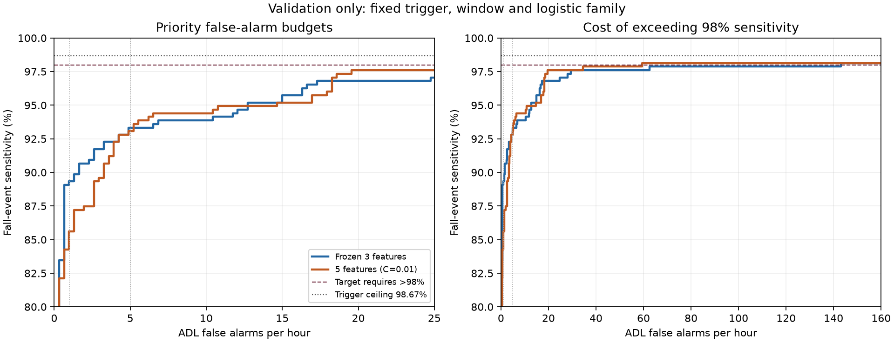

# Controlled causal accelerometer feature expansion

This is a predeclared, training/validation-only logistic study. Raw data, prior experiments, the three-feature frozen baseline, subject partitions, 200 Hz acquisition, causal 5 Hz Butterworth, raw-driven 0.5 Hz gravity EMA, selected trigger, 1.5 s refractory, pre100_post200 timing, matching tolerance and event accounting remain unchanged. No test sensor trials, candidate features or outcomes were used. Only training/validation manifests and raw trial files were replayed.

## Outcome and stopping decision

The 5-feature step fails the predeclared material-improvement screen. Stop here: the 7-feature model was NOT fitted. Recommend freezing the simpler existing 3-feature model; neither the new fits nor operating thresholds replace it.

Neither practical materiality nor validation target attainment is a statistical guarantee or hardware/wrist validation. Repeated reuse of the same development subjects creates selection optimism.

## Predeclared progression and selection

| feature_set | features | C |
|---|---|---|
| frozen3 | ga_C2, jerk_abs_mean, ga_parallel_peak | 10.0000 |
| expanded5 | ga_C2, jerk_abs_mean, ga_parallel_peak, late_mag_variance, late_minus_pre_jerk | 0.0100 |

The exact definitions, timing, units and MCU state/arithmetic estimates are in [FEATURE_DEFINITIONS.md](FEATURE_DEFINITIONS.md). The 5-feature set adds late magnitude variance and late-minus-pre magnitude jerk. The prospective 7-feature set additionally adds perpendicular active fraction and late signed-parallel standard deviation. No subset combinations, phase-length search, activity-cutoff tuning, other model family or neural network was tried.

The original train-fitted C=10 three-feature model is reused verbatim, including its scaler; it is not refitted or replaced. Each expanded model is fitted only on training candidates using a training-only StandardScaler and balanced L2/liblinear logistic regression. C is restricted to 0.01, 0.1, 1 and 10, with seed 473, tol 1e-8, max_iter 5000, and no validation refit. Fixed-C=10 controls are exported to help distinguish feature effects from C selection.

Hyperparameter selection was fixed before replay: prioritize achieving >98% sensitivity at <=1 FA/h, then at <=5; next maximize detected falls lexicographically at budgets 1,5,10,20, then minimize FA/h needed for >98%, >=95%, >=97%, then prefer smaller C. This prioritizes the stated low-alarm targets rather than maximizing BA. All reported frontier thresholds come from unique validation positive scores plus the no-alarm boundary. A BA-selected threshold is included as a descriptive reference, not used to select expanded-model C.

Material-improvement gate: >=1 percentage point sensitivity improvement at any requested budget 1/5/10/20 OR >=20% AND >=1 FA/h reduction in the rate required for >=95%, >=97%, or >98%; additionally require no >=1-point sensitivity regression at budgets 1 or 5. The 7-feature fit occurs only if the 5-feature step passes against frozen3. No additional feature search is allowed after this bounded progression. Gate results: {"five_vs_frozen": {"material": false, "budget_sensitivity_gains": {"FA_le_1": -0.03733333333333333, "FA_le_5": -0.002666666666666706, "FA_le_10": 0.005333333333333301, "FA_le_20": 0.008000000000000007}, "targets_with_at_least_20pct_and_1FAh_reduction": ["sens_ge97", "sens_gt98"]}}

## Engineering targets and remaining gap

**Primary:** fall-event sensitivity strictly >98% and ADL false alarms/hour <=1. **Secondary:** strictly >98% and <=5. These are engineering targets, not guarantees.

| feature_set | primary_achieved | secondary_achieved | max_sensitivity_FA_le_1 | max_sensitivity_FA_le_5 | minimum_FA_to_exceed98 | FA_gap_to_primary | FA_gap_to_secondary | extra_detected_falls_needed_at_FA1 | extra_detected_falls_needed_at_FA5 |
|---|---|---|---|---|---|---|---|---|---|
| frozen3 | False | False | 0.8933 | 0.9333 | 143.0927 | 142.0927 | 138.0927 | 33.0000 | 18.0000 |
| expanded5 | False | False | 0.8560 | 0.9307 | 59.3232 | 58.3232 | 54.3232 | 47.0000 | 19.0000 |

Validation has 375 fall trials. Strictly >98% requires at least **368 detected falls (98.1333%)**. Candidate recall is **370/375 = 98.6667%**, leaving room for at most **two classifier misses among matched falls** at a successful operating point. Five misses are unavoidable no-matched-trigger failures. The trigger ceiling is above 98%, so it does not by itself make the target impossible; additional missed matched candidates at a false-alarm budget are classifier/operating-point errors. 100% is impossible under this trigger. Each fitted model can reach the ceiling when accepting every candidate; the question is the false-alarm cost.

| feature_set | unavoidable_trigger_misses | additional_classifier_misses_at_FA1 | additional_classifier_misses_at_FA5 |
|---|---|---|---|
| frozen3 | 5.0000 | 35.0000 | 20.0000 |
| expanded5 | 5.0000 | 49.0000 | 21.0000 |

## Sensitivity–false-alarm operating points

| feature_set | operating_point | threshold | sensitivity | false_alarms_per_adl_hour | event_precision | trial_specificity | trial_balanced_accuracy | detected_falls | missed_falls |
|---|---|---|---|---|---|---|---|---|---|
| frozen3 | FA_le_1 | 0.9435 | 0.8933 | 0.9779 | 0.9654 | 0.9948 | 0.9440 | 335.0000 | 40.0000 |
| frozen3 | FA_le_5 | 0.8851 | 0.9333 | 4.8893 | 0.9309 | 0.9773 | 0.9553 | 350.0000 | 25.0000 |
| frozen3 | FA_le_10 | 0.8622 | 0.9387 | 6.8450 | 0.9167 | 0.9703 | 0.9545 | 352.0000 | 23.0000 |
| frozen3 | FA_le_20 | 0.7353 | 0.9680 | 17.2754 | 0.8403 | 0.9248 | 0.9464 | 363.0000 | 12.0000 |
| frozen3 | sens_ge95 | 0.7742 | 0.9520 | 12.7121 | 0.8707 | 0.9423 | 0.9472 | 357.0000 | 18.0000 |
| frozen3 | sens_ge97 | 0.6102 | 0.9707 | 24.7723 | 0.7913 | 0.8986 | 0.9346 | 364.0000 | 11.0000 |
| frozen3 | sens_gt98 | 0.0756 | 0.9813 | 143.0927 | 0.4044 | 0.5420 | 0.7616 | 368.0000 | 7.0000 |
| expanded5 | FA_le_1 | 0.8688 | 0.8560 | 0.9779 | 0.9727 | 0.9948 | 0.9254 | 321.0000 | 54.0000 |
| expanded5 | FA_le_5 | 0.7434 | 0.9307 | 4.8893 | 0.9332 | 0.9755 | 0.9531 | 349.0000 | 26.0000 |
| expanded5 | FA_le_10 | 0.7006 | 0.9440 | 6.5190 | 0.9219 | 0.9685 | 0.9563 | 354.0000 | 21.0000 |
| expanded5 | FA_le_20 | 0.5275 | 0.9760 | 19.5571 | 0.8243 | 0.9108 | 0.9434 | 366.0000 | 9.0000 |
| expanded5 | sens_ge95 | 0.5980 | 0.9520 | 14.6678 | 0.8582 | 0.9318 | 0.9419 | 357.0000 | 18.0000 |
| expanded5 | sens_ge97 | 0.5506 | 0.9707 | 18.2533 | 0.8311 | 0.9161 | 0.9434 | 364.0000 | 11.0000 |
| expanded5 | sens_gt98 | 0.3175 | 0.9813 | 59.3232 | 0.6248 | 0.7867 | 0.8840 | 368.0000 | 7.0000 |

For FA budgets, select maximum fall detections and then minimum FA/h, fewer total positive decisions, and higher threshold. For sensitivity targets, select minimum FA/h meeting the target; ties favor more detected falls, fewer total decisions and higher threshold. A sensitivity target may lie between discrete detection counts; >=95% means at least 357/375, >=97% at least 364/375, and >98% at least 368/375.

The closest budget-feasible Pareto points are the FA_le_1 and FA_le_5 rows. The closest sensitivity-feasible point is sens_gt98. These quantify the gap in each constraint without imposing an arbitrary combined distance measure. All nondominated validation points are exported in pareto_frontiers.csv, not just the operating points shown here.

| feature_set | operating_point | sensitivity_delta_pp | false_alarms_per_hour_delta | detected_falls_delta |
|---|---|---|---|---|
| frozen3 | FA_le_1 | 0.0000 | 0.0000 | 0.0000 |
| frozen3 | FA_le_5 | 0.0000 | 0.0000 | 0.0000 |
| frozen3 | FA_le_10 | 0.0000 | 0.0000 | 0.0000 |
| frozen3 | FA_le_20 | 0.0000 | 0.0000 | 0.0000 |
| frozen3 | sens_ge95 | 0.0000 | 0.0000 | 0.0000 |
| frozen3 | sens_ge97 | 0.0000 | 0.0000 | 0.0000 |
| frozen3 | sens_gt98 | 0.0000 | 0.0000 | 0.0000 |
| frozen3 | BA_reference | 0.0000 | 0.0000 | 0.0000 |
| expanded5 | FA_le_1 | -3.7333 | 0.0000 | -14.0000 |
| expanded5 | FA_le_5 | -0.2667 | 0.0000 | -1.0000 |
| expanded5 | FA_le_10 | 0.5333 | -0.3260 | 2.0000 |
| expanded5 | FA_le_20 | 0.8000 | 2.2817 | 3.0000 |
| expanded5 | sens_ge95 | 0.0000 | 1.9557 | 0.0000 |
| expanded5 | sens_ge97 | 0.0000 | -6.5190 | 0.0000 |
| expanded5 | sens_gt98 | 0.0000 | -83.7695 | 0.0000 |
| expanded5 | BA_reference | 1.0667 | 1.6298 | 4.0000 |

## Balanced-accuracy diagnostic

| feature_set | operating_point | threshold | sensitivity | false_alarms_per_adl_hour | event_precision | trial_specificity | trial_balanced_accuracy | detected_falls | missed_falls |
|---|---|---|---|---|---|---|---|---|---|
| frozen3 | BA_reference | 0.8851 | 0.9333 | 4.8893 | 0.9309 | 0.9773 | 0.9553 | 350.0000 | 25.0000 |
| expanded5 | BA_reference | 0.7006 | 0.9440 | 6.5190 | 0.9219 | 0.9685 | 0.9563 | 354.0000 | 21.0000 |

BA is the average of fall-trial sensitivity and ADL-trial specificity (fraction of ADL recordings with no positive decision). It is not event specificity. Event precision credits at most one matched detection per fall trial and divides by all emitted positive decisions, including duplicate and unmatched fall-recording alarms. ADL FA/h uses the full 3.0679416666666666 recorded ADL hours. No additional alarm-merging policy is applied.

## Per-activity failure modes

activity_metrics.csv and trial_results.csv contain all activity/trial outcomes for every listed operating point. At <=5 FA/h, the predeclared difficult activities are:

| model | activity | candidate_recall | sensitivity | false_alarms_per_hour | no_matched_candidate | matched_candidates_rejected |
|---|---|---|---|---|---|---|
| frozen3 | D03 | N/A | N/A | 0.0000 | 0.0000 | 0.0000 |
| frozen3 | D04 | N/A | N/A | 0.0000 | 0.0000 | 0.0000 |
| frozen3 | D06 | N/A | N/A | 5.7603 | 0.0000 | 0.0000 |
| frozen3 | D18 | N/A | N/A | 24.0012 | 0.0000 | 0.0000 |
| frozen3 | D19 | N/A | N/A | 84.0000 | 0.0000 | 0.0000 |
| frozen3 | F13 | 1.0000 | 0.8000 | N/A | 0.0000 | 5.0000 |
| frozen3 | F14 | 1.0000 | 1.0000 | N/A | 0.0000 | 0.0000 |
| frozen3 | F15 | 1.0000 | 0.9200 | N/A | 0.0000 | 2.0000 |
| expanded5 | D03 | N/A | N/A | 0.0000 | 0.0000 | 0.0000 |
| expanded5 | D04 | N/A | N/A | 0.0000 | 0.0000 | 0.0000 |
| expanded5 | D06 | N/A | N/A | 17.2808 | 0.0000 | 0.0000 |
| expanded5 | D18 | N/A | N/A | 72.0036 | 0.0000 | 0.0000 |
| expanded5 | D19 | N/A | N/A | 36.0000 | 0.0000 | 0.0000 |
| expanded5 | F13 | 1.0000 | 0.7600 | N/A | 0.0000 | 6.0000 |
| expanded5 | F14 | 1.0000 | 1.0000 | N/A | 0.0000 | 0.0000 |
| expanded5 | F15 | 1.0000 | 0.9600 | N/A | 0.0000 | 1.0000 |

The per-activity tables separately identify no-matched-candidate failures and falls whose complete matched candidates were all rejected. Activity-specific rates divide by short, unequal exposures and must not be interpreted as expected daily-life alarms/hour. The existing five no-matched-trigger trials remain unchanged; exact trial causes are preserved by the frozen candidate protocol.

## Fixed-C control

| feature_set | C | operating_point | sensitivity | false_alarms_per_adl_hour |
|---|---|---|---|---|
| expanded5 | 10 | FA_le_1 | 0.8213 | 0.9779 |
| expanded5 | 10 | FA_le_5 | 0.9120 | 4.2374 |
| expanded5 | 10 | FA_le_10 | 0.9440 | 8.8007 |
| expanded5 | 10 | FA_le_20 | 0.9707 | 16.9495 |
| expanded5 | 10 | sens_ge95 | 0.9520 | 13.6900 |
| expanded5 | 10 | sens_ge97 | 0.9707 | 16.9495 |
| expanded5 | 10 | sens_gt98 | 0.9813 | 78.5543 |

## Reproducibility, integrity and limits

experiment_plan.json was written before raw replay and fitting, including all four prospective definitions, gates, targets and C grid. Causal replay checks original manifest hashes; exact candidate times and the original three feature values are verified against the saved causal experiment for every candidate. All four prospective features are cached in one pass, but a skipped 7-feature model is never fitted. Computation at the saved decision time uses only arrived ring samples.

Frozen-model validation scores must match exactly. Source hashes are checked after fitting. feature_tests.json covers independent equations, segment-boundary exclusions, constant signals, rotations and prefix causality; extraction_verification.json records real-stream parity. Model parameters, scalers, scores, sweeps and selected points are saved separately. No deployment threshold or previous artifact is overwritten.

The raw-magnitude peak remains an evaluation-only impact proxy; positive candidate training labels use a +/-1 s trigger match and other candidates are negative. The pipeline is causal but the supervision is weak, and “late settling” is measured relative to a trigger rather than annotated impact. This is waist-mounted, simulated-fall data, not wrist validation. Float64 reference results and algebraic MCU cost estimates do not establish float32 firmware equivalence or measured hardware costs.

Run order in a fresh study output directory: causal_feature_expansion.py, test_causal_expansion.py, report_causal_expansion.py, verify_causal_expansion.py. Use Python -B to preserve existing bytecode/artifacts. No test evaluation is part of this study.
