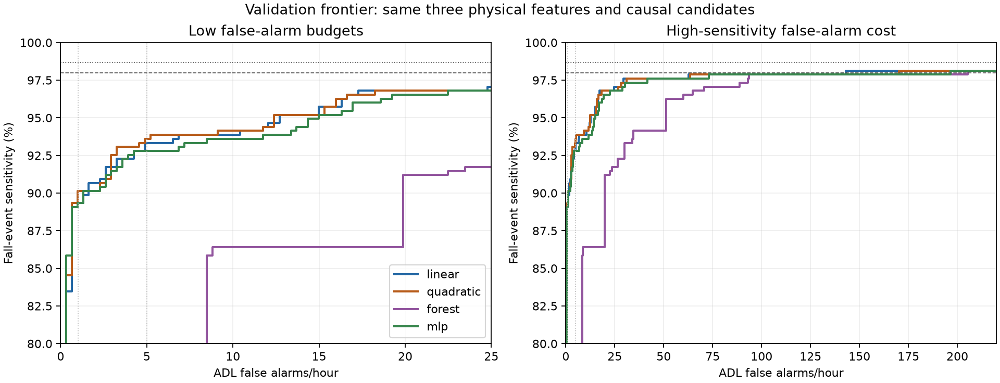

# Controlled causal model-capacity study

## Recommendation

None of the 14 fitted candidates satisfies the predeclared material-improvement rule. Recommend keeping the frozen linear MCU v1 baseline. No tested candidate currently warrants MCU v2 promotion, and no further architectures or feature search were run.

This bounded study provides no material evidence that replacing the linear boundary solves the current sensitivity/false-alarm limitation. It does not prove that the three features contain no additional information or that all nonlinear models would fail: only the predeclared small models, one seed, and a narrow regularization grid were tested on repeatedly reused development subjects.

## Fixed system and bounded search

MCU v1, its weights and all prior artifacts are unchanged. The only physical inputs are ga_C2, jerk_abs_mean, ga_parallel_peak, in that exact order. Subject partitions, 200 Hz sampling, causal fourth-order 5 Hz Butterworth, raw-driven 0.5 Hz gravity EMA, magnitude/jerk trigger, 300-sample refractory, pre100_post200 window, matching and event accounting are unchanged. Saved training/validation feature rows are reused; no test sensor data, test candidates or test outcomes are used.

- Linear: reuse the existing frozen train-fitted C=10 logistic model and scaler without refitting.
- Quadratic logistic: exactly `[x1,x2,x3,x1²,x2²,x3²,x1*x2,x1*x3,x2*x3]` formed from unstandardized physical features, then training-only StandardScaler; L2/liblinear, C=0.01/0.1/1/10, balanced classes, max_iter=5000, tol=1e-8. Four fits. No new sensor-derived feature is introduced.
- Forest: RandomForestClassifier, 5/10/20 trees × depth 2/3, min_samples_leaf=25, max_features=1.0, bootstrap=True, class_weight=balanced, n_jobs=1. Six fits. No boosted or larger forest is tried.
- Tiny MLP: 3→4→1 or 3→8→1 only; ReLU hidden layer, logistic output; training-only StandardScaler; L2 alpha=0.001/0.1; LBFGS, max_iter=2000, max_fun=50000, tol=1e-7; no early stopping or validation fitting. Training-only balanced sample weights address candidate class imbalance. Four fits. The optional second hidden layer was not used.
All new fits use seed 473. All 14 fits converged within their predeclared bounds. No extra seeds, architectures, retries with enlarged bounds, or features were searched.

Within each family, validation selection prioritizes the primary >98%/<=1 FA/h target, then secondary >98%/<=5, then sensitivity lexicographically at budgets 1/5/10/20, then lower FA at >98%, >=95%, >=97%, then smaller estimated flash and stronger regularization. Every candidate has a saved complete threshold sweep. The selected family representative is one model used across its whole frontier, not a different hyperparameter at each point.

## Stopping rule

A candidate qualifies only with >=1 percentage point higher sensitivity at any budget 1/5/10/20, OR >=20% lower FA/h at a target >=95%, >=97%, or >98%, while avoiding >=1-point regression at BOTH budgets1 AND5. The AND condition follows the request literally; a loss at only one low budget is still shown. There is no extra absolute-rate reduction requirement. All families are evaluated regardless of quadratic results, then the search stops.

| candidate | selected | material | gain_pp_FA1 | gain_pp_FA5 | gain_pp_FA10 | gain_pp_FA20 | FA_reduction_pct_sens_ge95 | FA_reduction_pct_sens_ge97 | FA_reduction_pct_sens_gt98 |
|---|---|---|---|---|---|---|---|---|---|
| linear_frozen | True | False | 0.0000 | 0.0000 | 0.0000 | 0.0000 | 0.0000 | 0.0000 | 0.0000 |
| quadratic_C0.01 | False | False | -5.3333 | -1.3333 | 0.8000 | -0.8000 | 0.0000 | -19.7368 | 49.6583 |
| quadratic_C0.1 | False | False | -0.8000 | 0.2667 | 0.0000 | 0.0000 | 12.8205 | -7.8947 | -27.3349 |
| quadratic_C1 | True | False | 0.8000 | 0.2667 | 0.2667 | 0.0000 | 2.5641 | -7.8947 | -18.9066 |
| quadratic_C10 | False | False | -0.2667 | -0.2667 | 0.2667 | 0.0000 | -7.6923 | -7.8947 | -19.8178 |
| forest_t5_d2 | False | False | -89.3333 | -93.3333 | -93.8667 | -96.8000 | -794.8718 | -359.2105 | -627.3349 |
| forest_t5_d3 | False | False | -89.3333 | -93.3333 | -7.4667 | -10.4000 | -402.5641 | -234.2105 | -627.3349 |
| forest_t10_d2 | False | False | -89.3333 | -93.3333 | -93.8667 | -96.8000 | -792.3077 | -357.8947 | -627.3349 |
| forest_t10_d3 | False | False | -89.3333 | -93.3333 | -7.4667 | -10.4000 | -302.5641 | -182.8947 | -63.7813 |
| forest_t20_d2 | False | False | -89.3333 | -93.3333 | -93.8667 | -96.8000 | -792.3077 | -357.8947 | -627.3349 |
| forest_t20_d3 | True | False | -89.3333 | -93.3333 | -7.4667 | -5.6000 | -302.5641 | -185.5263 | -43.5080 |
| mlp_h4_a0.001 | False | False | -1.0667 | -0.5333 | 0.0000 | 0.0000 | -17.9487 | -6.5789 | -68.3371 |
| mlp_h4_a0.1 | False | False | -1.0667 | -0.2667 | 0.0000 | 0.0000 | -17.9487 | -6.5789 | -63.7813 |
| mlp_h8_a0.001 | True | False | 0.0000 | -0.5333 | -0.2667 | -0.2667 | -17.9487 | -17.1053 | -37.3576 |
| mlp_h8_a0.1 | False | False | -4.8000 | -1.3333 | -0.5333 | -0.8000 | -25.6410 | -3.9474 | -37.3576 |

## Ranked comparison

Ranking is lexicographic: low-FA sensitivities at 1,5,10,20; high-sensitivity FA cost at >98%,95%,97%; then estimated model flash. A first-place ranking does not mean the gain passes materiality.

| rank | candidate | sensitivity_FA1 | sensitivity_FA5 | sensitivity_FA10 | sensitivity_FA20 | FA_sens_ge95 | FA_sens_ge97 | FA_sens_gt98 | estimated_flash_bytes | multiplications | comparisons |
|---|---|---|---|---|---|---|---|---|---|---|---|
| 1.0000 | quadratic_C1 | 0.9013 | 0.9360 | 0.9413 | 0.9680 | 12.3862 | 26.7280 | 170.1467 | 44.0000 | 15.0000 | 1.0000 |
| 2.0000 | linear_frozen | 0.8933 | 0.9333 | 0.9387 | 0.9680 | 12.7121 | 24.7723 | 143.0927 | 20.0000 | 3.0000 | 1.0000 |
| 3.0000 | mlp_h8_a0.001 | 0.8933 | 0.9280 | 0.9360 | 0.9653 | 14.9938 | 29.0097 | 196.5487 | 168.0000 | 32.0000 | 9.0000 |
| 4.0000 | forest_t20_d3 | 0.0000 | 0.0000 | 0.8640 | 0.9120 | 51.1744 | 70.7315 | 205.3494 | 3328.0000 | 1.0000 | 61.0000 |

Sensitivity columns are fractions; rate columns are alarms/hour. Quadratic C=1 improves <=1 FA/h by three falls, +0.8 percentage points, not the required >=1 point (at least four additional falls here). Its approximately 2.56% reduction in FA cost at >=95% is also below 20%, and its >=97% and >98% costs worsen. The selected MLP does not improve the priority budgets. The forest has a coarse/tied highest score block; inspect top_score_tie_diagnostics.csv. A no-alarm threshold is the best <=1 and <=5 point for the selected forest, not a missing result or arbitrary tie-breaking.

## Complete selected operating-point metrics

Plot y-axes are cropped to 80–100% for detail; forest zero-sensitivity budget points are reported in the tables, not visible in this crop.

| candidate | operating_point | threshold | sensitivity | false_alarms_per_adl_hour | event_precision | trial_specificity | trial_balanced_accuracy | detected_falls | missed_falls | total_alarms |
|---|---|---|---|---|---|---|---|---|---|---|
| linear_frozen | FA_le_1 | 0.9435 | 0.8933 | 0.9779 | 0.9654 | 0.9948 | 0.9440 | 335.0000 | 40.0000 | 347.0000 |
| linear_frozen | FA_le_5 | 0.8851 | 0.9333 | 4.8893 | 0.9309 | 0.9773 | 0.9553 | 350.0000 | 25.0000 | 376.0000 |
| linear_frozen | FA_le_10 | 0.8622 | 0.9387 | 6.8450 | 0.9167 | 0.9703 | 0.9545 | 352.0000 | 23.0000 | 384.0000 |
| linear_frozen | FA_le_20 | 0.7353 | 0.9680 | 17.2754 | 0.8403 | 0.9248 | 0.9464 | 363.0000 | 12.0000 | 432.0000 |
| linear_frozen | sens_ge95 | 0.7742 | 0.9520 | 12.7121 | 0.8707 | 0.9423 | 0.9472 | 357.0000 | 18.0000 | 410.0000 |
| linear_frozen | sens_ge97 | 0.6102 | 0.9707 | 24.7723 | 0.7913 | 0.8986 | 0.9346 | 364.0000 | 11.0000 | 460.0000 |
| linear_frozen | sens_gt98 | 0.0756 | 0.9813 | 143.0927 | 0.4044 | 0.5420 | 0.7616 | 368.0000 | 7.0000 | 910.0000 |
| linear_frozen | BA_reference | 0.8851 | 0.9333 | 4.8893 | 0.9309 | 0.9773 | 0.9553 | 350.0000 | 25.0000 | 376.0000 |
| quadratic_C1 | FA_le_1 | 0.9422 | 0.9013 | 0.9779 | 0.9657 | 0.9948 | 0.9480 | 338.0000 | 37.0000 | 350.0000 |
| quadratic_C1 | FA_le_5 | 0.8931 | 0.9360 | 4.8893 | 0.9335 | 0.9773 | 0.9566 | 351.0000 | 24.0000 | 376.0000 |
| quadratic_C1 | FA_le_10 | 0.8291 | 0.9413 | 9.1266 | 0.8959 | 0.9615 | 0.9514 | 353.0000 | 22.0000 | 394.0000 |
| quadratic_C1 | FA_le_20 | 0.7079 | 0.9680 | 18.2533 | 0.8364 | 0.9213 | 0.9447 | 363.0000 | 12.0000 | 434.0000 |
| quadratic_C1 | sens_ge95 | 0.7798 | 0.9520 | 12.3862 | 0.8729 | 0.9458 | 0.9489 | 357.0000 | 18.0000 | 409.0000 |
| quadratic_C1 | sens_ge97 | 0.5643 | 0.9707 | 26.7280 | 0.7761 | 0.8916 | 0.9311 | 364.0000 | 11.0000 | 469.0000 |
| quadratic_C1 | sens_gt98 | 0.0645 | 0.9813 | 170.1467 | 0.3590 | 0.5140 | 0.7477 | 368.0000 | 7.0000 | 1025.0000 |
| quadratic_C1 | BA_reference | 0.9102 | 0.9307 | 3.2595 | 0.9458 | 0.9860 | 0.9583 | 349.0000 | 26.0000 | 369.0000 |
| forest_t20_d3 | FA_le_1 | 0.9877 | 0.0000 | 0.0000 | N/A | 1.0000 | 0.5000 | 0.0000 | 375.0000 | 0.0000 |
| forest_t20_d3 | FA_le_5 | 0.9877 | 0.0000 | 0.0000 | N/A | 1.0000 | 0.5000 | 0.0000 | 375.0000 | 0.0000 |
| forest_t20_d3 | FA_le_10 | 0.9616 | 0.8640 | 8.8007 | 0.9050 | 0.9650 | 0.9145 | 324.0000 | 51.0000 | 358.0000 |
| forest_t20_d3 | FA_le_20 | 0.9212 | 0.9120 | 19.8830 | 0.8143 | 0.9371 | 0.9245 | 342.0000 | 33.0000 | 420.0000 |
| forest_t20_d3 | sens_ge95 | 0.6841 | 0.9627 | 51.1744 | 0.6612 | 0.8636 | 0.9132 | 361.0000 | 14.0000 | 546.0000 |
| forest_t20_d3 | sens_ge97 | 0.3178 | 0.9707 | 70.7315 | 0.5919 | 0.8339 | 0.9023 | 364.0000 | 11.0000 | 615.0000 |
| forest_t20_d3 | sens_gt98 | 0.0966 | 0.9813 | 205.3494 | 0.3411 | 0.6661 | 0.8237 | 368.0000 | 7.0000 | 1079.0000 |
| forest_t20_d3 | BA_reference | 0.7086 | 0.9413 | 34.5509 | 0.7339 | 0.9231 | 0.9322 | 353.0000 | 22.0000 | 481.0000 |
| mlp_h8_a0.001 | FA_le_1 | 0.9602 | 0.8933 | 0.9779 | 0.9626 | 0.9948 | 0.9440 | 335.0000 | 40.0000 | 348.0000 |
| mlp_h8_a0.001 | FA_le_5 | 0.9386 | 0.9280 | 4.2374 | 0.9380 | 0.9808 | 0.9544 | 348.0000 | 27.0000 | 371.0000 |
| mlp_h8_a0.001 | FA_le_10 | 0.8917 | 0.9360 | 8.4747 | 0.9023 | 0.9633 | 0.9496 | 351.0000 | 24.0000 | 389.0000 |
| mlp_h8_a0.001 | FA_le_20 | 0.7735 | 0.9653 | 19.2311 | 0.8284 | 0.9196 | 0.9425 | 362.0000 | 13.0000 | 437.0000 |
| mlp_h8_a0.001 | sens_ge95 | 0.8312 | 0.9520 | 14.9938 | 0.8520 | 0.9371 | 0.9445 | 357.0000 | 18.0000 | 419.0000 |
| mlp_h8_a0.001 | sens_ge97 | 0.5692 | 0.9707 | 29.0097 | 0.7647 | 0.8794 | 0.9250 | 364.0000 | 11.0000 | 476.0000 |
| mlp_h8_a0.001 | sens_gt98 | 0.0503 | 0.9813 | 196.5487 | 0.3105 | 0.4738 | 0.7276 | 368.0000 | 7.0000 | 1185.0000 |
| mlp_h8_a0.001 | BA_reference | 0.9386 | 0.9280 | 4.2374 | 0.9380 | 0.9808 | 0.9544 | 348.0000 | 27.0000 | 371.0000 |

All unique validation score boundaries plus a no-alarm boundary are swept with score>=threshold. Budget points maximize sensitivity, then minimize FA/h, total positive decisions, then prefer a higher threshold. Target points minimize FA/h subject to sensitivity, then prefer more detections and fewer decisions. No-alarm precision is undefined (N/A). BA_reference is a diagnostic point on each selected model, not a changed MCU v1 threshold.

| candidate | operating_point | sensitivity_delta_pp | detected_falls_delta | FA_per_hour_delta |
|---|---|---|---|---|
| linear_frozen | FA_le_1 | 0.0000 | 0.0000 | 0.0000 |
| linear_frozen | FA_le_5 | 0.0000 | 0.0000 | 0.0000 |
| linear_frozen | FA_le_10 | 0.0000 | 0.0000 | 0.0000 |
| linear_frozen | FA_le_20 | 0.0000 | 0.0000 | 0.0000 |
| linear_frozen | sens_ge95 | 0.0000 | 0.0000 | 0.0000 |
| linear_frozen | sens_ge97 | 0.0000 | 0.0000 | 0.0000 |
| linear_frozen | sens_gt98 | 0.0000 | 0.0000 | 0.0000 |
| linear_frozen | BA_reference | 0.0000 | 0.0000 | 0.0000 |
| quadratic_C1 | FA_le_1 | 0.8000 | 3.0000 | 0.0000 |
| quadratic_C1 | FA_le_5 | 0.2667 | 1.0000 | 0.0000 |
| quadratic_C1 | FA_le_10 | 0.2667 | 1.0000 | 2.2817 |
| quadratic_C1 | FA_le_20 | 0.0000 | 0.0000 | 0.9779 |
| quadratic_C1 | sens_ge95 | 0.0000 | 0.0000 | -0.3260 |
| quadratic_C1 | sens_ge97 | 0.0000 | 0.0000 | 1.9557 |
| quadratic_C1 | sens_gt98 | 0.0000 | 0.0000 | 27.0540 |
| quadratic_C1 | BA_reference | -0.2667 | -1.0000 | -1.6298 |
| forest_t20_d3 | FA_le_1 | -89.3333 | -335.0000 | -0.9779 |
| forest_t20_d3 | FA_le_5 | -93.3333 | -350.0000 | -4.8893 |
| forest_t20_d3 | FA_le_10 | -7.4667 | -28.0000 | 1.9557 |
| forest_t20_d3 | FA_le_20 | -5.6000 | -21.0000 | 2.6076 |
| forest_t20_d3 | sens_ge95 | 1.0667 | 4.0000 | 38.4623 |
| forest_t20_d3 | sens_ge97 | 0.0000 | 0.0000 | 45.9592 |
| forest_t20_d3 | sens_gt98 | 0.0000 | 0.0000 | 62.2567 |
| forest_t20_d3 | BA_reference | 0.8000 | 3.0000 | 29.6616 |
| mlp_h8_a0.001 | FA_le_1 | 0.0000 | 0.0000 | 0.0000 |
| mlp_h8_a0.001 | FA_le_5 | -0.5333 | -2.0000 | -0.6519 |
| mlp_h8_a0.001 | FA_le_10 | -0.2667 | -1.0000 | 1.6298 |
| mlp_h8_a0.001 | FA_le_20 | -0.2667 | -1.0000 | 1.9557 |
| mlp_h8_a0.001 | sens_ge95 | 0.0000 | 0.0000 | 2.2817 |
| mlp_h8_a0.001 | sens_ge97 | 0.0000 | 0.0000 | 4.2374 |
| mlp_h8_a0.001 | sens_gt98 | 0.0000 | 0.0000 | 53.4560 |
| mlp_h8_a0.001 | BA_reference | -0.5333 | -2.0000 | -0.6519 |

## Engineering targets and remaining gaps

| candidate | primary_achieved | secondary_achieved | sensitivity_at_FA1 | sensitivity_at_FA5 | minimum_FA_to_exceed98 | FA_gap_primary | FA_gap_secondary | detections_short_of_target_at_FA1 | detections_short_of_target_at_FA5 |
|---|---|---|---|---|---|---|---|---|---|
| linear_frozen | False | False | 0.8933 | 0.9333 | 143.0927 | 142.0927 | 138.0927 | 33.0000 | 18.0000 |
| quadratic_C1 | False | False | 0.9013 | 0.9360 | 170.1467 | 169.1467 | 165.1467 | 30.0000 | 17.0000 |
| forest_t20_d3 | False | False | 0.0000 | 0.0000 | 205.3494 | 204.3494 | 200.3494 | 368.0000 | 368.0000 |
| mlp_h8_a0.001 | False | False | 0.8933 | 0.9280 | 196.5487 | 195.5487 | 191.5487 | 33.0000 | 20.0000 |

Strict >98% requires 368 of 375 validation falls. Trigger candidate recall is 370/375=98.6667%, so successful classification can lose at most two matched falls. Five no-matched-trigger misses are unavoidable; the fixed trigger therefore prevents 100%, but does not itself prevent >98%. Additional misses under an alarm budget are classifier/operating-point errors. The FA_le_1/FA_le_5 and sens_gt98 rows are the Pareto points closest along the respective constraints; no arbitrary joint distance metric is introduced.

| candidate | trigger_misses | classifier_misses_at_FA1 | classifier_misses_at_FA5 |
|---|---|---|---|
| linear_frozen | 5.0000 | 35.0000 | 20.0000 |
| quadratic_C1 | 5.0000 | 32.0000 | 19.0000 |
| forest_t20_d3 | 5.0000 | 370.0000 | 370.0000 |
| mlp_h8_a0.001 | 5.0000 | 35.0000 | 22.0000 |

## Model-specific MCU complexity

| candidate | model_numeric_parameters | scaler_statistics | float32_numeric_parameter_bytes | estimated_flash_bytes | multiplications | additions | comparisons | nonlinear | extra_ram_bytes |
|---|---|---|---|---|---|---|---|---|---|
| linear_frozen | 4.0000 | 6.0000 | 16.0000 | 20.0000 | 3.0000 | 3.0000 | 1.0000 | none for binary logit comparison; score output adds sigmoid | 4.0000 |
| quadratic_C1 | 10.0000 | 18.0000 | 40.0000 | 44.0000 | 15.0000 | 9.0000 | 1.0000 | none for binary logit comparison; score output adds sigmoid | 40.0000 |
| forest_t20_d3 | 270.0000 | 0.0000 | 1080.0000 | 3328.0000 | 1.0000 | 19.0000 | 61.0000 | tree branches; no exp/sqrt | 8.0000 |
| mlp_h8_a0.001 | 41.0000 | 6.0000 | 164.0000 | 168.0000 | 32.0000 | 32.0000 | 9.0000 | 8 ReLU max(0,z); no sigmoid needed for binary logit comparison | 36.0000 |

Counts exclude all shared causal preprocessing, sensor-derived feature extraction, and the existing event buffer. They are scalar estimates, not measured firmware cycles, memory high-water marks or power. Model_numeric_parameters counts weights+biases for logistic/MLP. For forests it counts one split threshold per internal node and one positive-class score per leaf (one numeric scalar per node); feature IDs and topology are separate structural parameters included in estimated flash. Scaler_statistics counts additional learned training means/scales, excluded from the model-weight count.

Flash estimates use float32 constants, scaler fusion, and one separate operating threshold. Linear: 4 model constants + threshold =20 bytes; quadratic:10+threshold=44 bytes. Without fusion, scaler statistics add 24 or72 bytes. Quadratic input expansion costs six multiplications in addition to nine dot-product multiplies; extra RAM budgets nine terms plus accumulator (40 bytes). An implementation could stream terms for less RAM, but no such firmware is validated.

For the selected 3→8→1 MLP, weights/biases total 3*8+8+8+1=41, plus an output threshold:168 bytes. The input scaler can be folded into the first layer; the output sigmoid can be replaced by comparison to logit(threshold). It needs32 multiplies,32 adds,8 ReLU comparisons plus the final comparison, and approximately36 bytes of hidden/output working state. The 3→4→1 alternatives have21 model parameters,88 bytes including threshold,16 multiplies/adds,4 ReLUs plus final comparison, and20 bytes activation state. Unfused input scaling adds24 bytes and three subtract/divide operations. Score output, rather than binary inference, adds sigmoid exp/division.

Forest flash assumes an aligned12-byte node storing float32 threshold/leaf score and routing/feature metadata, four bytes per root index, and8 bytes for mean reciprocal and classifier threshold. Worst comparisons sum actual tree depths plus one final threshold comparison. Leaf-score averaging requires T-1 additions and one multiplication by1/T. No nonlinear math library is needed, but branches and routing storage dominate. The floating constants alone are smaller than the full tree table. extra_ram_bytes budgets accumulator plus current-node index, excluding call stack.

These fusion/float32 estimates are algebraic deployment possibilities, not claims of bitwise equivalence. The saved models and exported parameters remain float64 desktop references; no deployment threshold or firmware is created.

## Per-activity failure modes

| model | activity | candidate_recall | sensitivity | false_alarms_per_hour | no_matched_candidate | matched_candidates_rejected |
|---|---|---|---|---|---|---|
| linear_frozen | D03 | N/A | N/A | 0.0000 | 0.0000 | 0.0000 |
| linear_frozen | D04 | N/A | N/A | 0.0000 | 0.0000 | 0.0000 |
| linear_frozen | D06 | N/A | N/A | 5.7603 | 0.0000 | 0.0000 |
| linear_frozen | D18 | N/A | N/A | 24.0012 | 0.0000 | 0.0000 |
| linear_frozen | D19 | N/A | N/A | 84.0000 | 0.0000 | 0.0000 |
| linear_frozen | F13 | 1.0000 | 0.8000 | N/A | 0.0000 | 5.0000 |
| linear_frozen | F14 | 1.0000 | 1.0000 | N/A | 0.0000 | 0.0000 |
| linear_frozen | F15 | 1.0000 | 0.9200 | N/A | 0.0000 | 2.0000 |
| quadratic_C1 | D03 | N/A | N/A | 0.0000 | 0.0000 | 0.0000 |
| quadratic_C1 | D04 | N/A | N/A | 0.0000 | 0.0000 | 0.0000 |
| quadratic_C1 | D06 | N/A | N/A | 5.7603 | 0.0000 | 0.0000 |
| quadratic_C1 | D18 | N/A | N/A | 24.0012 | 0.0000 | 0.0000 |
| quadratic_C1 | D19 | N/A | N/A | 84.0000 | 0.0000 | 0.0000 |
| quadratic_C1 | F13 | 1.0000 | 0.8000 | N/A | 0.0000 | 5.0000 |
| quadratic_C1 | F14 | 1.0000 | 1.0000 | N/A | 0.0000 | 0.0000 |
| quadratic_C1 | F15 | 1.0000 | 0.9200 | N/A | 0.0000 | 2.0000 |
| forest_t20_d3 | D03 | N/A | N/A | 0.0000 | 0.0000 | 0.0000 |
| forest_t20_d3 | D04 | N/A | N/A | 0.0000 | 0.0000 | 0.0000 |
| forest_t20_d3 | D06 | N/A | N/A | 0.0000 | 0.0000 | 0.0000 |
| forest_t20_d3 | D18 | N/A | N/A | 0.0000 | 0.0000 | 0.0000 |
| forest_t20_d3 | D19 | N/A | N/A | 0.0000 | 0.0000 | 0.0000 |
| forest_t20_d3 | F13 | 1.0000 | 0.0000 | N/A | 0.0000 | 25.0000 |
| forest_t20_d3 | F14 | 1.0000 | 0.0000 | N/A | 0.0000 | 25.0000 |
| forest_t20_d3 | F15 | 1.0000 | 0.0000 | N/A | 0.0000 | 25.0000 |
| mlp_h8_a0.001 | D03 | N/A | N/A | 0.0000 | 0.0000 | 0.0000 |
| mlp_h8_a0.001 | D04 | N/A | N/A | 0.0000 | 0.0000 | 0.0000 |
| mlp_h8_a0.001 | D06 | N/A | N/A | 5.7603 | 0.0000 | 0.0000 |
| mlp_h8_a0.001 | D18 | N/A | N/A | 24.0012 | 0.0000 | 0.0000 |
| mlp_h8_a0.001 | D19 | N/A | N/A | 72.0000 | 0.0000 | 0.0000 |
| mlp_h8_a0.001 | F13 | 1.0000 | 0.7600 | N/A | 0.0000 | 6.0000 |
| mlp_h8_a0.001 | F14 | 1.0000 | 1.0000 | N/A | 0.0000 | 0.0000 |
| mlp_h8_a0.001 | F15 | 1.0000 | 0.9200 | N/A | 0.0000 | 2.0000 |

activity_metrics.csv and trial_results.csv contain every activity and trial at every listed selected operating point. Event sensitivity credits one matched positive candidate per fall trial. All additional positive decisions, including duplicates/unmatched fall-recording alarms, count against event precision; ADL FA/h uses the full3.0679416666666666 ADL hours. ADL trial specificity counts trials without alarms, and trial BA averages it with sensitivity. There is no event true-negative denominator. Model differences cannot repair a missing candidate.

## Evidence and limitations

experiment_plan.json was written before fitting and hashes MCU v1 plus all authoritative inputs and relevant code. verification.json records baseline score identity and unchanged hashes. candidate_operating_points.csv, all_candidate_materiality.csv, per-candidate sweeps and fit_status.csv expose the entire bounded search. model_parameters.json and per-fit joblib files preserve fitted models separately. This run reads only saved train/validation candidates and performs no raw replay or test evaluation.

Training candidate labels remain weak proxy labels: fall trial AND trigger within +/-1 s of the raw-magnitude peak, otherwise negative. Validation was already reused for preprocessing/trigger/window/model development. Small differences may be sampling or selection noise; no significance claim or independent generalization result is made. Waist-mounted simulated falls do not validate a wrist device. No MLP architecture/seed expansion or new feature search follows these results.
