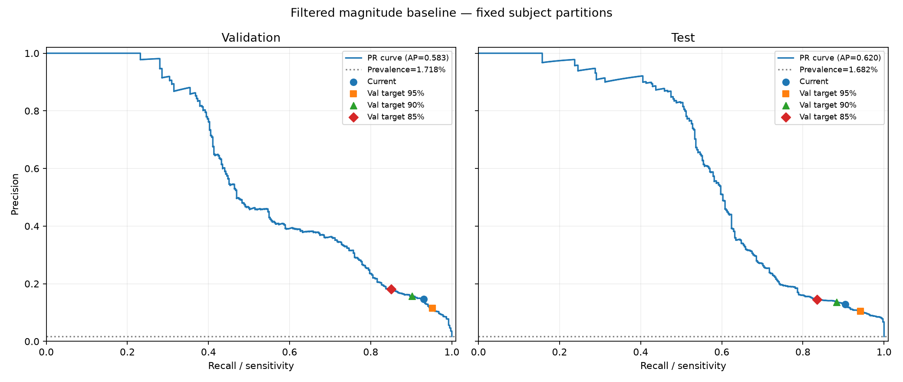

# Filtered baseline failure analysis

Existing threshold: **2.209465981 g**. Existing subject splits and input artifacts are unchanged.

Errors below use the current threshold. Operating thresholds are selected exclusively on validation: choose the highest threshold meeting the requested sensitivity, which maximizes specificity under that constraint. Test sensitivities are measured outcomes, not guaranteed targets.

## Main failure modes

Jogging (D03/D04) dominates false alarms: 1,548/2,035 (76.1%) in validation and 1,903/2,296 (82.9%) in test. Fast jogging alone flags 75.6% and 84.3% of its windows, respectively. Fast stairs (D06), jumping (D19), and stumbling (D18) account for most remaining errors. A peak-only rule cannot distinguish these high-acceleration ADL windows from fall impacts.

Missed falls cluster around seated falls and sitting/standing transitions. F13–F15 contribute 11/26 validation misses and 17/36 test misses. F13 is the largest validation failure group (10/25, 40% missed); F13 and F15 each miss 6/25 test falls. Their selected filtered peaks fall below the threshold. This is consistent with overlapping peak-magnitude distributions, but does not establish whether filtering or event localization caused a particular miss.

All three validation sensitivity targets fall short on test subjects. Lowering the threshold to the validation 95% point reduces test misses from 36 to 22 but increases false positives from 2,296 to 3,001. Raising it improves precision at the cost of more misses. Temporal or posture features are a reasonable next non-neural experiment, evaluated with the fixed split.

## Operating points

| point | split | threshold_g | sensitivity | specificity | precision | f1 | balanced_accuracy |
| --- | --- | --- | --- | --- | --- | --- | --- |
| current | validation | 2.209466 | 93.07% | 90.52% | 14.64% | 25.30% | 91.79% |
| validation_sensitivity_95 | validation | 2.091736 | 95.20% | 87.15% | 11.46% | 20.46% | 91.18% |
| validation_sensitivity_90 | validation | 2.253582 | 90.13% | 91.60% | 15.79% | 26.88% | 90.87% |
| validation_sensitivity_85 | validation | 2.335879 | 85.07% | 93.30% | 18.16% | 29.92% | 89.18% |
| current | test | 2.209466 | 90.40% | 89.53% | 12.87% | 22.52% | 89.96% |
| validation_sensitivity_95 | test | 2.091736 | 94.13% | 86.31% | 10.52% | 18.93% | 90.22% |
| validation_sensitivity_90 | test | 2.253582 | 88.27% | 90.42% | 13.62% | 23.59% | 89.34% |
| validation_sensitivity_85 | test | 2.335879 | 83.47% | 91.63% | 14.57% | 24.81% | 87.55% |

## ADL false positives

| code | description | validation | test |
| --- | --- | --- | --- |
| D01 | Walking slowly | 0/1584 (0.0%) | 0/1744 (0.0%) |
| D02 | Walking quickly | 0/1589 (0.0%) | 0/1752 (0.0%) |
| D03 | Jogging slowly | 345/1592 (21.7%) | 427/1751 (24.4%) |
| D04 | Jogging quickly | 1203/1592 (75.6%) | 1476/1751 (84.3%) |
| D05 | Walking upstairs and downstairs slowly | 0/1956 (0.0%) | 0/1956 (0.0%) |
| D06 | Walking upstairs and downstairs quickly | 269/1219 (22.1%) | 193/1174 (16.4%) |
| D07 | Slowly sit in a half height chair, wait a moment, and up slowly | 0/915 (0.0%) | 0/916 (0.0%) |
| D08 | Quickly sit in a half height chair, wait a moment, and up quickly | 0/917 (0.0%) | 4/920 (0.4%) |
| D09 | Slowly sit in a low height chair, wait a moment, and up slowly | 0/918 (0.0%) | 0/920 (0.0%) |
| D10 | Quickly sit in a low height chair, wait a moment, and up quickly | 0/919 (0.0%) | 0/919 (0.0%) |
| D11 | Sitting a moment, trying to get up, and collapse into a chair | 13/913 (1.4%) | 8/900 (0.9%) |
| D12 | Sitting a moment, lying slowly, wait a moment, and sit again | 0/920 (0.0%) | 0/917 (0.0%) |
| D13 | Sitting a moment, lying quickly, wait a moment, and sit again | 0/574 (0.0%) | 0/574 (0.0%) |
| D14 | Being on one’s back change to lateral position, wait a moment, and change to one’s back | 0/920 (0.0%) | 0/917 (0.0%) |
| D15 | Standing, slowly bending at knees, and getting up | 0/920 (0.0%) | 0/900 (0.0%) |
| D16 | Standing, slowly bending without bending knees, and getting up | 0/912 (0.0%) | 0/894 (0.0%) |
| D17 | Standing, get into a car, remain seated and get out of the car | 0/1948 (0.0%) | 0/1870 (0.0%) |
| D18 | Stumble while walking | 52/573 (9.1%) | 37/574 (6.4%) |
| D19 | Gently jump without falling (trying to reach a high object) | 153/575 (26.6%) | 151/574 (26.3%) |

## Fall false negatives

| code | description | validation | test |
| --- | --- | --- | --- |
| F01 | Fall forward while walking caused by a slip | 1/25 (4.0%) | 0/25 (0.0%) |
| F02 | Fall backward while walking caused by a slip | 0/25 (0.0%) | 0/25 (0.0%) |
| F03 | Lateral fall while walking caused by a slip | 1/25 (4.0%) | 2/25 (8.0%) |
| F04 | Fall forward while walking caused by a trip | 0/25 (0.0%) | 0/25 (0.0%) |
| F05 | Fall forward while jogging caused by a trip | 0/25 (0.0%) | 0/25 (0.0%) |
| F06 | Vertical fall while walking caused by fainting | 1/25 (4.0%) | 0/25 (0.0%) |
| F07 | Fall while walking, with use of hands in a table to dampen fall, caused by fainting | 4/25 (16.0%) | 2/25 (8.0%) |
| F08 | Fall forward when trying to get up | 1/25 (4.0%) | 4/25 (16.0%) |
| F09 | Lateral fall when trying to get up | 2/25 (8.0%) | 4/25 (16.0%) |
| F10 | Fall forward when trying to sit down | 1/25 (4.0%) | 4/25 (16.0%) |
| F11 | Fall backward when trying to sit down | 2/25 (8.0%) | 2/25 (8.0%) |
| F12 | Lateral fall when trying to sit down | 2/25 (8.0%) | 1/25 (4.0%) |
| F13 | Fall forward while sitting, caused by fainting or falling asleep | 10/25 (40.0%) | 6/25 (24.0%) |
| F14 | Fall backward while sitting, caused by fainting or falling asleep | 0/25 (0.0%) | 5/25 (20.0%) |
| F15 | Lateral fall while sitting, caused by fainting or falling asleep | 1/25 (4.0%) | 6/25 (24.0%) |

## Interpretation and files

- validation: average precision 0.5832; fall prevalence 1.72%.
- test: average precision 0.6198; fall prevalence 1.68%.

`threshold_sweep.csv` contains every distinct validation/test score boundary plus the selected operating points and a no-positive boundary. Both partitions are evaluated at identical thresholds; the test sweep is descriptive and must not be used to select a deployment threshold. Precision is defined as zero when no windows are predicted positive; the PR curve uses the conventional final (recall=0, precision=1) point without a threshold.

`activity_errors.csv` includes denominators, error rates, error shares, and affected trials/subjects. `error_windows.csv` identifies every erroneous window for inspection. `operating_points.csv` includes confusion counts and all requested metrics. `precision_recall.csv` contains full curve coordinates. `summary.json` records input hashes and checks.

Counts are window-level: overlapping ADL windows can count the same movement more than once; fall trials contribute one selected event each. Compare error rates as well as counts because activity durations and exposure differ. Event-centered labeling and offline filtering remain unchanged. These results do not estimate streaming false alarms/hour. Activity descriptions come from the local raw dataset Readme.txt (read-only).
