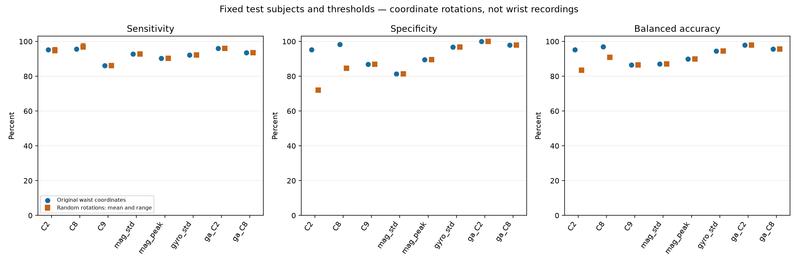
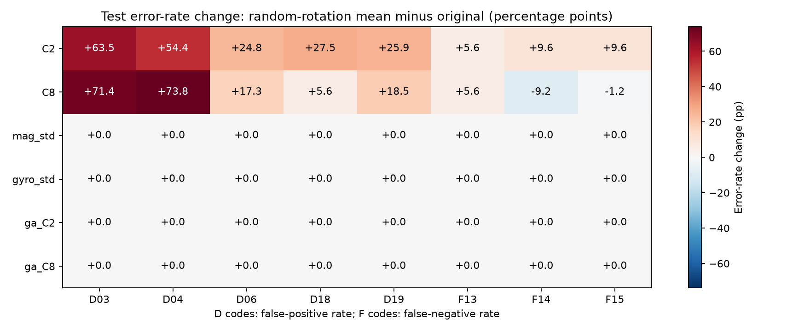

# Orientation study findings

The original paper results are preserved. This report describes fixed-threshold changes on waist recordings under synthetic coordinate rotations; it does not validate a wrist detector.

## C2/C8 axis dependence

- **C2**: original test BA 95.23%; random rotations mean 83.42% (range 82.74%–84.28%). 90° y-yaw BA 95.23%; 90° x-tilt BA 77.57%.

- **C8**: original test BA 97.00%; random rotations mean 90.86% (range 90.05%–91.79%). 90° y-yaw BA 97.00%; 90° x-tilt BA 89.56%.

The yaw/tilt controls directly test the x/z assumption: rotation inside that plane leaves scores unchanged, while mixing in y changes scores and decisions. This isolates coordinate dependence without changing physical samples or retuning thresholds.

## Robust scores and limits

All magnitude features, gyro-magnitude features, C9, and gravity-aligned features passed numerical invariance checks. Their metrics and requested activity errors remain unchanged under the tested constant rotations. Rotation invariance does not imply good discrimination: consult the original-score table before considering a feature useful.

C9 is already invariant, whereas C3 is not generally invariant. Gravity-aligned features depend on transforming gravity history together with the window, and may perform differently from the paper horizontal features because a 0.5 Hz estimate follows some motion and posture changes. No test-based feature selection is performed.

Gravity state uses raw samples causally. Existing zero-phase signal filtering and label-aware event localization remain offline. Neither invariance nor the operation estimates establish MCU readiness or accuracy at the wrist.

- **mag_peak**, unchanged by rotations: sensitivity 90.40%, specificity 89.53%, balanced accuracy 89.96%, precision 12.87%, F1 22.52%, PR-AUC 0.6196.

- **gyro_std**, unchanged by rotations: sensitivity 92.27%, specificity 96.87%, balanced accuracy 94.57%, precision 33.49%, F1 49.15%, PR-AUC 0.8404.

- **ga_C2**, unchanged by rotations: sensitivity 96.00%, specificity 99.93%, balanced accuracy 97.96%, precision 95.74%, F1 95.87%, PR-AUC 0.9809.

- **ga_C8**, unchanged by rotations: sensitivity 93.60%, specificity 97.83%, balanced accuracy 95.72%, precision 42.49%, F1 58.45%, PR-AUC 0.9213.

Complete tables: [REPORT.md](REPORT.md), [metrics.csv](metrics.csv), [target_activity_summary.csv](target_activity_summary.csv). Equations, causal-state initialization, operation counts and storage estimates: [ORIENTATION_METHODS.md](../sisfall/ORIENTATION_METHODS.md).

Recreate these plots and this findings summary with `python outputs/sisfall/orientation_report.py outputs/orientation_study`. No evaluation is rerun and thresholds are not changed.
