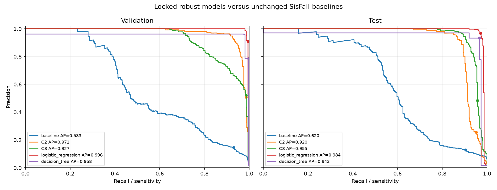

# Non-neural robust classifier findings

Both families are reported; test outcomes were not used to choose between them. Candidate features and grids were declared before fitting. Training-only standardization, validation-only hyperparameter/threshold selection, and the fixed subject partitions were retained.

## Fixed test results

| model | sensitivity | specificity | balanced_accuracy | precision | f1 | pr_auc_trapezoidal | average_precision | FP | FN |
| --- | --- | --- | --- | --- | --- | --- | --- | --- | --- |
| baseline | 90.40% | 89.53% | 89.96% | 12.87% | 22.52% | 61.96% | 61.98% | 2296 | 36 |
| C2 | 95.20% | 95.26% | 95.23% | 25.55% | 40.29% | 92.00% | 92.00% | 1040 | 18 |
| C8 | 95.73% | 98.26% | 97.00% | 48.45% | 64.34% | 95.53% | 95.53% | 382 | 16 |
| logistic_regression | 97.07% | 99.95% | 98.51% | 96.81% | 96.94% | 98.44% | 98.45% | 12 | 11 |
| decision_tree | 96.53% | 99.88% | 98.21% | 93.30% | 94.89% | 96.29% | 94.27% | 26 | 13 |

## Requested failure modes

Original test errors / total; the complete validation breakdown is in REPORT.md.

| activity | baseline | C2 | C8 | logistic_regression | decision_tree |
| --- | --- | --- | --- | --- | --- |
| D03 | 427/1751 (24.4%) | 304/1751 (17.4%) | 8/1751 (0.5%) | 0/1751 (0.0%) | 0/1751 (0.0%) |
| D04 | 1476/1751 (84.3%) | 605/1751 (34.6%) | 305/1751 (17.4%) | 0/1751 (0.0%) | 2/1751 (0.1%) |
| D06 | 193/1174 (16.4%) | 13/1174 (1.1%) | 18/1174 (1.5%) | 0/1174 (0.0%) | 0/1174 (0.0%) |
| D18 | 37/574 (6.4%) | 32/574 (5.6%) | 18/574 (3.1%) | 0/574 (0.0%) | 10/574 (1.7%) |
| D19 | 151/574 (26.3%) | 0/574 (0.0%) | 0/574 (0.0%) | 1/574 (0.2%) | 0/574 (0.0%) |
| F13 | 6/25 (24.0%) | 1/25 (4.0%) | 1/25 (4.0%) | 2/25 (8.0%) | 2/25 (8.0%) |
| F14 | 5/25 (20.0%) | 0/25 (0.0%) | 6/25 (24.0%) | 1/25 (4.0%) | 2/25 (8.0%) |
| F15 | 6/25 (24.0%) | 0/25 (0.0%) | 2/25 (8.0%) | 1/25 (4.0%) | 0/25 (0.0%) |

## Rotations

All model features and predictions were recomputed from rotated vectors and rotated causal gravity history. Unlike the earlier feature study, model scores were not canonicalized to their original values.

- logistic_regression: 0 changed predictions across validation/test rotation evaluations; maximum score difference 3.66e-15.

- decision_tree: 0 changed predictions across validation/test rotation evaluations; maximum score difference 0.

## Interpretation limits

The linear and shallow-tree models combine orientation-robust statistics, but rotation robustness alone does not establish wrist performance. These remain waist recordings with offline filtering and event-centered fall selection. Activity exposure is imbalanced and overlapping ADL windows are correlated; the counts are not false alarms per hour. Validation tuning can overfit its subjects, so its selected score is not an independent estimate.

No further feature, threshold or hyperparameter changes were made after test evaluation. MCU float32 feature extraction and a causal filter/trigger need separate validation; the current export parity check is against the existing offline features.

Complete tables: [REPORT.md](REPORT.md), [rotation_summary.csv](rotation_summary.csv), [target_activity_summary.csv](target_activity_summary.csv). Exact fitted features/parameters: [model_parameters.json](model_parameters.json). [MCU estimates](MCU.md).
